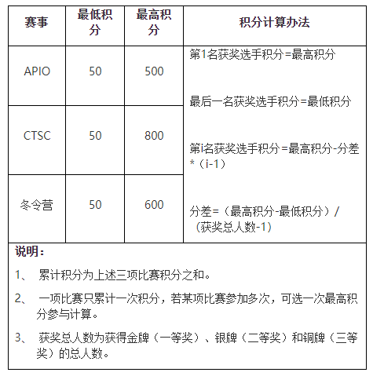

# 全国青少年信息学奥林匹克竞赛系列活动简介

CCF(China Computer Federation) 中国计算机学会

## 宗旨

旨在向那些在中学阶段学习的青少年普及计算机科学知识；给学校的信息技术教育课程提供动力和新的思路；给那些有才华的学生提供相互交流和学习的机会；通过竞赛和相关的活动培养和选拔优秀计算机人才。

## 背景

1984年邓小平指出：“计算机的普及要从娃娃做起。”中国计算机学会于1984年创办**全国青少年计算机程序设计竞赛**（简称：**NOI，National Olympiad in Informatics**），当年参加竞赛的有8000多人。这一新的活动形式受到党和政府的关怀，得到社会各界的关注与支持。中央领导王震同志出席了首届竞赛发奖大会，并对此项活动给予了充分肯定。从此每年一次NOI活动，吸引越来越多的青少年投身其中。十几年来，通过竞赛活动培养和发现了大批计算机爱好者，选拔出了许多优秀的计算机后备人才。当年的许多选手已成为计算机硕士、博士，有的已经走上计算机科研岗位。

为了在更高层次上推动普及，培养更多的计算机技术优秀人才。竞赛及相关活动遵循开放性原则，任何有条件和兴趣的学校和个人，都可以在业余时间自愿参加。

**NOI系列活动包括：**

1. NOI:全国青少年信息学奥林匹克竞赛和全国青少年信息学奥林匹克网上同步赛
2. NOIP:全国青少年信息学奥林匹克联赛
3. CSP-J/S:CCF非专业级软件能力认证
3. WC:冬令营
4. CTS:选拔赛
5. IOI-出国参加

### NOIP (National Olympiad in Informatics in Provinces)

全国青少年信息学奥林匹克联赛(NOIP)**自1995年至2018年共24届**，每年由中国计算机学会统一组织。NOIP在同一时间、不同地点以各省市为单位由特派员组织，全国统一大纲、统一试卷。初、高中或其他中等专业学校的学生可报名参加联赛，联赛分初赛和复赛两个阶段。初赛考察通用和实用的计算机科学知识，以笔试为主。复赛为程序设计，须在计算机上调试完成。参加初赛者须达到一定分数线后才有资格参加复赛。联赛分普及组和提高组两个组别，难度不同，分别面向初中和高中阶段的学生。

### CSP-J/S (Certified Software Professional Junior/Senior)

**CCF非专业级软件能力认证(CSP-J/S)创办于2019年**，是由CCF统一组织的评价计算机非专业人士算法和编程能力的活动。在同一时间、不同地点以各省市为单位由CCF授权的省认证组织单位和总负责人组织。全国统一大纲、统一认证题目，任何人均可报名参加。CSP-J/S分两个级别进行，分别为CSP-J（入门级，Junior）和CSP-S（提高级，Senior），两个级别难度不同，均涉及算法和编程。

**CSP-J/S分第一轮和第二轮两个阶段:**

1. 第一轮考察通用和实用的计算机科学知识，以笔试为主，部分省市以机试方式认证。
2. 第二轮为程序设计，须在计算机上调试完成。

第一轮认证成绩优异者进入第二轮认证，第二轮认证结束后，CCF将根据CSP-J/S各组的认证成绩和给定的分数线，颁发认证证书。**CSP-J/S成绩优异者，可参加NOI省级选拔，省级选拔成绩优异者可参加NOI**。

### NOI (NOI，National Olympiad in Informatics)

全国青少年信息学奥林匹克（NOI）是国内包括港澳在内的省级代表队最高水平的大赛，自1984年至今，在国内包括香港、澳门组织竞赛活动。每年经各省选拔产生5名选手（其中一名是女选手），由中国计算机学会在计算机普及较好的城市组织进行比赛。这一竞赛记个人成绩，同时记团体总分。

NOI期间，举办同步夏令营和NOI网上同步赛，给那些程序设计爱好者和高手提供机会。为增加竞赛的竞争性、对抗性和趣味性以及可视化，NOI组织进行团体对抗赛，团体对抗赛实质上是程序对抗赛，其成绩纳入总分计算。

### WC (Winter Camp)

全国青少年信息学奥林匹克冬令营(简称冬令营WC)自1995年起，每年在寒假期间开展为期一周的培训活动。冬令营共8天，包括授课、 讲座、讨论、测试等。参加冬令营的营员分正式营员和非正式营员。获得NOI前20名的选手和指导教师为正式营员，非正式营员限量自愿报名参加。在冬令营授课的是著名大学的资深教授及已获得国际金牌学生的指导教师。

### CTS (China Team Selection)

选拔参加国际信息学奥林匹克中国代表队的竞赛（简称选拔赛CTS）。2018年及以前称作国际信息学奥林匹克中国队选拔赛（China Team Selection Competition，简称CTSC）。IOI的选手是从获NOI前20名选手中选拔出来的，获得前4名的优胜者代表中国参加国际竞赛。选拔科目包括：NOI成绩、冬令营成绩、论文和答辩、平时作业、选拔赛成绩、口试。上述项目加权产生最后成绩。

### APIO (Asia Pacific Informatics Olympiad)

亚洲与太平洋地区信息学奥赛(APIO)2007年创建。该竞赛为区域性的网上准同步赛，是亚洲和太平洋地区每年一次的国际性赛事，旨在给青少年提供更多的赛事机会，推动亚太地区的信息学奥林匹克的发展。APIO每年5月举行，由不同的国家轮流主办。每个参赛团参赛选手上限为100名，其中成绩排在前6名的选手作为代表该参赛团的正式选手统计成绩。APIO中国赛区由中国计算机学会组织参赛，获奖比例将参照IOI。

### IOI (International Olympiad in Informatics)

出国参加国际信息学奥林匹克竞赛（简称IOI）。由中国计算机学会组织代表队，代表中国参加国际每年一次的IOI。中国是IOI创始国之一，IOI2000由中国主办，CCF承办。出国参赛得到中国科协和国家自然科学基金委的资助。自1989年开始，我国在NOI（网上同步赛99年开始）、NOIP、冬令营、选拔赛的基础上，组织参加国际信息学奥林匹克（IOI）竞赛。十几年中选拔75人次参加了IOI，累计获金牌46块、银牌17块，铜牌12块。这些选手不仅在国际大赛中有好的表现，而且在现代的信息学科上也大展才华。中国已成为世界公认的信息学奥林匹克竞赛强国，参赛选手、领队、教练曾受到江泽民、李鹏、李岚清等党和国家领导人及著名科学家的亲切接见和赞扬。

## 大满贯参赛流程

1. CSP-J
2. CSP-S
3. PTS (Province Team Selection)
4. NOI
5. APIO
6. WC
7. CTS
8. IOI 

## 参考网址

1. [https://www.ccf.org.cn/](https://www.ccf.org.cn/)
2. [http://www.noi.cn/newsview.html?id=66&hash=9CB0C5&type=5](http://www.noi.cn/newsview.html?id=66&hash=9CB0C5&type=5)
3. [http://history.noi.cn/](http://history.noi.cn/)
4. [http://www.noi.cn/](http://www.noi.cn/)

# CCF关于开展中学生计算机程序设计能力等级评价的通知

为规范和引导青少年学习计算机程序设计知识，评价青少年计算机程序设计水平，发现和培养未来学习计算机科学的人才，CCF于2013年设立《青少年计算机程序设计评价标准》课题，并组织NOI部分优秀教师对该课题进行研究，于2014年7月形成评价体系并予以发布。凡参加NOI系列活动的选手均可参加等级评价。

## 一、评价标准

CCF中学生程序设计能力等级评价共分十级，评价标准如下：

1. 一级：NOIP初赛（CSP-J/S第一轮）60分以上（此级不颁发等级证书）；
2. 二级：NOIP初赛（CSP-J/S第一轮）80分以上（此级不颁发等级证书）；
3. 三级：进入NOIP复赛（CSP-J/S第二轮）；
4. 四级：在NOIP普及组（或提高组）复赛（CSP-J/S第二轮）中成绩列全国前50%；
5. 五级：在NOIP普及组复赛（CSP-J第二轮）中成绩列全国前20%；
6. 六级：在NOIP提高组复赛（CSP-S第二轮）中成绩列全国前20%；
7. 七级：在NOIP提高组复赛（CSP-S第二轮）中成绩列全国前10%；
8. 八级：NOI铜牌或累计积分250分以上的选手可获得八级资格。积分折算详见“积分计算表”；
9. 九级：NOI银牌或累计积分500分以上的选手可获得九级资格。积分折算详见“积分计算表”；
10. 十级：NOI金牌或累计积分1000分以上的选手可获得十级资格。积分折算详见“积分计算表”（后附）。

## 二、实施办法

1. 选手自愿申请，按申请之日算，计算选手参加NOI系列活动近3年成绩。
2. 可跨级申请，即可以不依次序申请一二三。。。。至十级；可以根据成绩直接申请相应级。比如选手可按照成绩，直接申请8级，无需由一级申请到八级。
3. 选手申请，经CCF审核后，按照选手成绩达到的最高级别进行评级并发放证书。比如，选手申请的是8级，但实际成绩达到6级，即按照6级发放证书。

## 三、申请时间

不限时间，全年均可申请。

## 四、受理时间

以月为单位，CCF每月20日集中处理当月申请，30日集中下发当月审核通过的电子证书。

## 五、申请费用：0元

CCF为符合评级标准的选手免费发放电子版等级证书。

## 六、申请方式

1. 优先以学校为单位，由教师统一为选手进行申请；无直接指导教师的选手，可个人进行申请。
2. 申请时填写申请表（见附件）发送至邮箱（linhe@ccf.org.cn）申请。邮件主题为“等级评价+学校（或姓名）”。

## 七、注意事项

1. 未按规定申请者，CCF有权不予受理。
2. 申请期间，如有问题可发送邮件咨询。

## 八、评级结果将在定期在NOI网站公示 

此通知。

中国计算机学会 2019年8月26日

## 附：CCF中学生程序设计能力等级评价积分计算表

## 参考网址

1. [http://www.noi.cn/newsview.html?id=933&hash=5E43AC&type=1](http://www.noi.cn/newsview.html?id=933&hash=5E43AC&type=1)

# CCF关于NOI省队选拔的规定

为规范各省参加CCF NOI（以下简称NOI）选手的选拔方式，中国计算机学会（CCF）制定如下规则。

1. 省选是各省选拔参加NOI选手的必要环节，各省必须组织省选。如遇不可抗拒的原因未能组织省选，须在当年CCF NOI举行四个月前报CCF，批准后实施。未经CCF批准，该省不得参加当年NOI。
2. 省选应在当年**CCF NOI举行前三个月内举行，最迟不得晚于NOI举行前45天**。
3. 参加省选的选手按照学籍学校报名，NOI各省组织单位负责审核信息。
4. 参加省选的选手**根据参加CSP-S组第二轮认证成绩（下同）依次选取**，参加人数不得低于本省参加NOI人数的3倍。上一年CSP-S组第二轮认证线在全国一级认证基准线及以上的省，参加选拔的选手须满足全国一级认证基准线的要求，若全国一级认证基准线上人数不足时，可适当降低至全国二级认证基准线，最低不低于本省二级认证线；当全国一级认证基准线上人数足够时不适用此方法。当参加省选报名人数不足本省NOI省队名额3倍时，则省选名额按照报名人数的三分之一选拔，但不低于A队名额。
5. **以A或B类选手身份参加NOI者必须参加省选**。 初中生如参加了上年CSP-S组第二轮认证且成绩满足上述要求，则有资格按本规定参加省内选拔。
6. 省内选拔必须包括至少一轮对接NOI的程序设计测试。
7. 省内选拔环境由各省自行统一指定，且至少在选拔前3周进行公告。
8. 省内选拔组织单位不得以一个学校参加CSP-JS的人数为由限制和剥夺该校选手参加省选和入选省队的资格。对于在上年CSP-S组第二轮认证线达到或超过NOI科学委员会规定的基准线的省份，一个学校参加NOI的名额不超过本省A、B名额总数的三分之一（四舍五入），**得分最高且入选A队的女选手不占该比例**。
9. 一个选手的CSP-S组第二轮认证成绩占省选总成绩（标准分）的比例最低为30%，最高不超过60%，具体比例由各省自定。
10. 如有若干选手的省选总成绩分数相同，按照CSP-S组第二轮认证成绩选择；如分数仍然相同，高年级选手有较高的优先权；如选手年级仍相同，省组织单位可组织面试或加试。
11. 省选结果必须在省选结束后立刻公示，不少于7天。公示期结束后确定省队名单。**省选总成绩排在前5名的选手（4男1女）进入A队（女选手的成绩可单独排序），其他选手根据给定名额和所得分数依次进入B队**。 如A队没有女选手，则女选手名额作废。省选后，省组织单位须将参加省选的全部选手名单和其得分以及入选省队的选手名单于NOI举行一个月前报送CCF。
12. 省内选拔应保证命题的公正性和题目的保密性，命题者和组织者不得有培训或辅导等和参加选拔者利益相关的行为。若干省可以使用同样题目在同一时间内选拔。
13. 省内选拔不收取“选拔费”，但选手参加选拔所需住宿、交通、餐饮、保险等相关服务需缴纳相关费用，标准由各省核定，报CCF备案。
14. 省选方案需经省竞赛委员会和技术委员会讨论通过，省选一个半月前报CCF审查，审查通过后向全体选手和学校公布并实施。
15. 对省选结果的申诉首先提交至NOI省组织单位，NOI省组织单位不能决定的或者对省组织单位的决定不服者可以申诉至CCF。CCF受理实名投诉，投诉请至NOI竞赛办公室（noi@ccf.org.cn）。
16. 本规定由CCF制定，由CCF NOI科学委员会负责解释。
17. 本规定从公布之日起执行。

### 中国计算机学会 2019年9月19日

## 参考网址

1. [http://www.noi.cn/newsview.html?id=948&hash=4F897E&type=1](http://www.noi.cn/newsview.html?id=948&hash=4F897E&type=1)

