# 学习资源

## 网站

1. CCF官网 [https://www.ccf.org.cn/](https://www.ccf.org.cn/)
2. NOI官网 [http://www.noi.cn/](http://www.noi.cn/)
3. NOI旧版网站 [http://history.noi.cn/](http://history.noi.cn/)
4. NOI辽宁官网 [http://lnnoi.dlu.edu.cn/](http://lnnoi.dlu.edu.cn/)
5. 信息学奥赛一本通做题网站一 [http://noi.openjudge.cn/](http://noi.openjudge.cn/)
6. 信息学奥赛一本通做题网站二 [http://ybt.ssoier.cn:8088/](http://ybt.ssoier.cn:8088/)
7. CCF中学生计算机程序设计做题网站 [http://oj.noi.cn/](http://oj.noi.cn/)
8. 落谷 [https://www.luogu.org/](https://www.luogu.org/)
9. C++ [http://www.cplusplus.com/reference/](http://www.cplusplus.com/reference/)
10. C++菜鸟教程 [https://www.runoob.com/cplusplus/cpp-tutorial.html](https://www.runoob.com/cplusplus/cpp-tutorial.html)
11. 力扣 [https://leetcode-cn.com/](https://leetcode-cn.com/)

## 图书

1. CCF中学生计算机程序设计系列   
  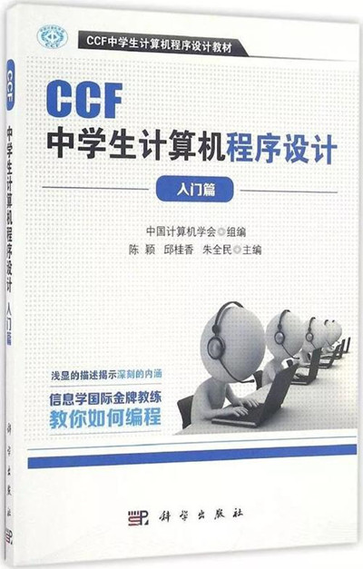   
  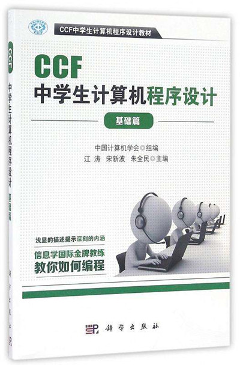   
  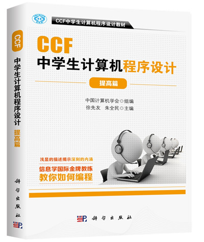   
2. 信息学奥数一本通系列（三本）   
  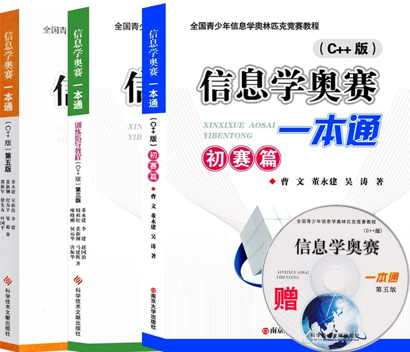   
3. 算法竞赛入门经典系列（三本）   
  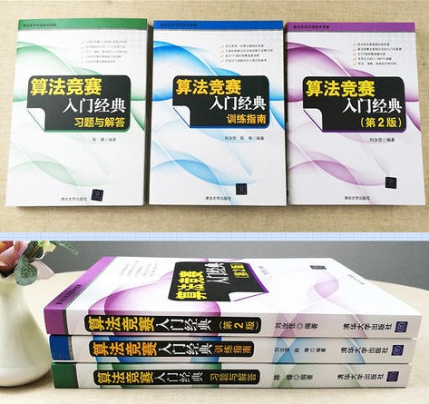   
4. 算法竞赛进阶指南    
  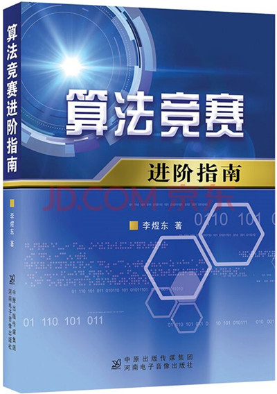   
5. 挑战编程-程序设计竞赛训练手册    
  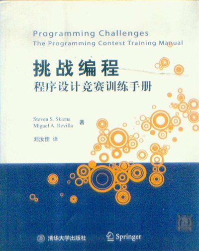   
6. 挑战程序设计系列   
  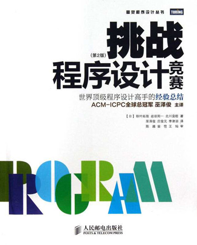   
  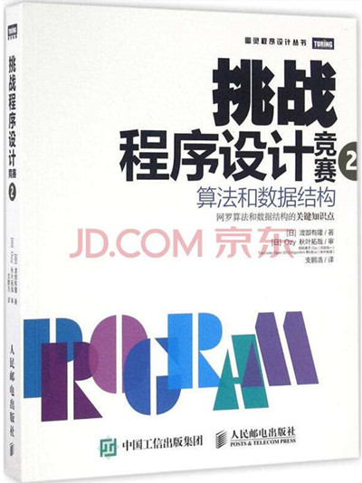   
7. 算法图解   
  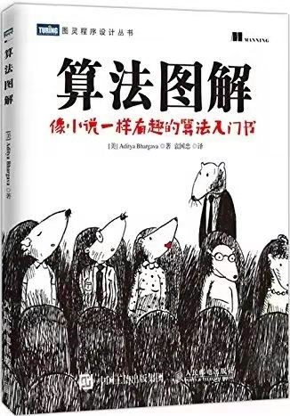   
8. 漫画算法   
  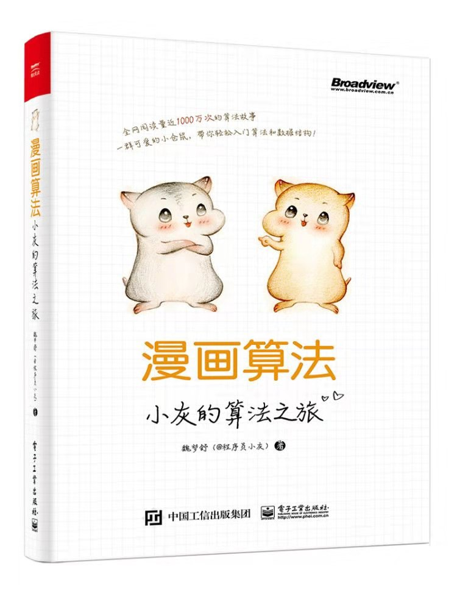   

## 订阅号

1. 饺子片汤儿：jiaozipiantang
2. 程序员小灰：chengxuyuanxiaohui
3. 算法爱好者：AlgorithmFans

## 编辑整理

辽宁师范大学 &bull; 张大为@[https://daweizh.github.io/noip/](https://daweizh.github.io/noip/)

