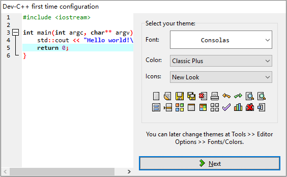
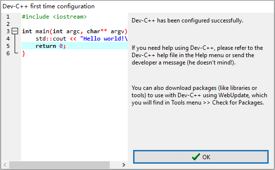
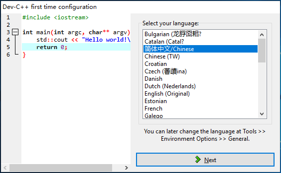
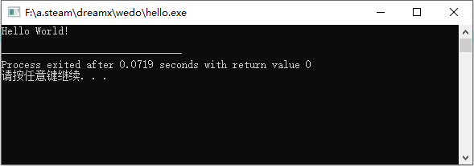

# 准备编程环境

辽宁师范大学 &bull; 张大为@[https://daweizh.github.io/noip/](https://daweizh.github.io/noip/)

## 组建工作环境

```shell
D:\NOI
├─ideas
├─tools
└─wedo
```

## 查看操作系统类型

1. `win+d`返回桌面
2. 查看计算机属性   
  
3. 查看系统类型    
  

## 部署Dev CPP

1. 解压Dev CPP软件包到当前文件下
    1. 32位操作系统解压Dev-Cpp 5.8.0 TDM-GCC 4.8.1 Portable.7z   
        
    2. 64位操作系统解压Dev-Cpp 5.11 TDM-GCC x64 4.9.2 Portable.7z   
        
2. 移动Dev-Cpp文件夹到ideas文件夹下（`Ctrl+x`是剪切，`Ctrl+v`是粘贴）
3. 进入Dev-Cpp文件夹，双击devcppPortable.exe执行**首次配置**流程    
  
4. 英文配置界面
  
  
  
  
5. 中文配置界面
  
  
  
  

## Hello World

1. `Ctrl+n` 新建文件
2. 输入程序代码   
  
  [*]表示该文件没有存盘
  Untitle表示该文件没有命名
3. `Ctrl+s` 保存文件    
  
4. 继续完善程序，按`Ctrl+s`保存文件    
     
  问题：正在修改的程序存盘了吗？
5. `F11` 编译执行程序   
  
6. 查看信息   
     
    1. 光标
    2. 错误数 0
    3. 警告数 0
    4. 生成文件的名字 hello.exe
    5. 生成文件的大小 1.877MB
    6. 编译时间 5.31s
    7. 光标在第6行
    8. 光标在第5列
    9. 选择字符数 0
    10. 程序代码行 12
    11. 程序总长度 120个字符
    12. 光标处于插入状态
    13. 用0.016秒完成解析


