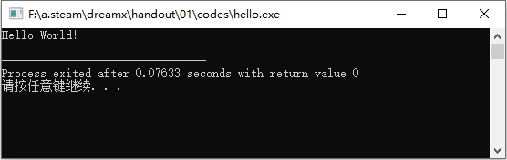

# 什么是程序

辽宁师范大学 &bull; 张大为@[https://daweizh.github.io/noip/](https://daweizh.github.io/noip/)

程序一般会有两种状态：

1. 源代码文件
2. 可执行文件

在源代码文件和可执行文件中间可能有多种不同类型的过渡文件。

C++程序的源代码文件是“文件名.cpp”。文件名最好是有意义的英文名，最差是不用中文起名，如“hello.cpp”是有意义的C++源代码文件名。“.cpp”是文件的扩展名，用来标记文件的类型或意义，又如“文件名.txt”是简单的文本文件，“.exe”是windows下的可执行文件等等，下面简单列一些。

- cpp C++源代码文件
- exe widnows下的可执行文件
- txt 简单的字符编码文件如ASCII文件
- in  数据输入文件
- ans 答案文件
- out 数据输出文件

源代码文件是人写的给人看的，大部分是由英文单词和字母写成的，例如hello.cpp：

```c++ {.line-numbers}
#include <iostream>
using namespace std;

int main(){
    
    cout << "Hello World!" << endl;
    
    return 0;
} 
```

在Dev cpp编程环境中按`F9`键，Dev帮你调用g++编译器将hello.cpp编译成hello.exe，现在这个hello.exe安静地保存在与hello.cpp相同的位置，计算并不执行它。


如果你按`F11`键，Dev帮你执行hello.exe并看到结果。



hello.exe是通过g++将hello.cpp翻译成的计算机能读懂的程序，大概是下面的样子：


## 了解命令窗口

几个windows快捷组合键

- win+d 返回桌面
- win+x 快速菜单
- win+r 运行对话框

按住win键同时按r键出现如下对话框，在输入框中输入cmd指令，


打开命令窗口。


其中C:\User\Dawei是你在磁盘中的当前位置，这个位置你一定要随时了解，否则你就丢了。

命令窗口是人和计算机说话、聊天、下达命令的交互界面，常用的命令可能是

- `盘符：` 改变当前磁盘，例如`d:`切换到D盘去
- `dir` 当前目录内容列表
- `cd` 改变当前目录，例如`cd code`由当前目录进入到code目录
- `可执行文件名` 执行一个程序文件，例如`hello.exe`

现在，我知道我的hello.cpp和hello.exe保存在如下位置


可是在命令窗口中如何找到hello.exe并执行他呢？ 可用如下命令进行操作：

1. C:\Users\dawei>f:
2. F:\>cd a.steam
3. F:\a.steam>cd dreamx
4. F:\a.steam\dreamx>cd handout
5. F:\a.steam\dreamx\handout>cd 01
6. F:\a.steam\dreamx\handout\01>cd codes
7. F:\a.steam\dreamx\handout\01\codes>

查看一下当前目录下有什么内容

```shell
F:\a.steam\dreamx\handout\01\codes>dir
 
 驱动器 F 中的卷是 Mine
 卷的序列号是 5439-F4B4

 F:\a.steam\dreamx\handout\01\codes 的目录

2019/10/18  12:21    <DIR>          .
2019/10/18  12:21    <DIR>          ..
2019/10/18  10:50               114 hello.cpp
2019/10/18  11:01         1,921,118 hello.exe
               2 个文件      1,921,232 字节
               2 个目录 57,788,055,552 可用字节
```

我们看到了hello.cpp和hello.exe的详细信息。那，如何执行hello.exe这个可执行程序呢？输入如下命令：

```shell
F:\a.steam\dreamx\handout\01\codes>hello.exe
```

得到如下系统的回应

```shell
Hello World!

F:\a.steam\dreamx\handout\01\codes>
```

正是我们所编程序的输出结果。

像dir这种命令是找不到程序文件的是内部命令，由操作系统自带。而像hello.exe这种可执行程序，也叫命令，是系统以外的命令，叫外部命令。这种外部命令，必须有可执行文件。

## 命令参数

如果一个命令只完成一个功能不仅单一，而且浪费。命令的通用格式是可以带参数的，在Windows下内部命令可用`/?`参数查看更多参数，例如，查看dir的参数，可用如下命令：

```shell
dir /?
```

系统会显示dir命令的详细用法

```shell
显示目录中的文件和子目录列表。

DIR [drive:][path][filename] [/A[[:]attributes]] [/B] [/C] [/D] [/L] [/N]
  [/O[[:]sortorder]] [/P] [/Q] [/R] [/S] [/T[[:]timefield]] [/W] [/X] [/4]

  [drive:][path][filename]
              指定要列出的驱动器、目录和/或文件。

  /A          显示具有指定属性的文件。
  属性         D  目录                R  只读文件
               H  隐藏文件            A  准备存档的文件
               S  系统文件            I  无内容索引文件
               L  重新分析点          O  脱机文件
               -  表示“否”的前缀
  /B          使用空格式(没有标题信息或摘要)。
  /C          在文件大小中显示千位数分隔符。这是默认值。用 /-C 来
              禁用分隔符显示。
  /D          跟宽式相同，但文件是按栏分类列出的。
  /L          用小写。
  /N          新的长列表格式，其中文件名在最右边。
  /O          用分类顺序列出文件。
  排列顺序     N  按名称(字母顺序)     S  按大小(从小到大)
               E  按扩展名(字母顺序)   D  按日期/时间(从先到后)
               G  组目录优先           -  反转顺序的前缀
  /P          在每个信息屏幕后暂停。
  /Q          显示文件所有者。
  /R          显示文件的备用数据流。
  /S          显示指定目录和所有子目录中的文件。
  /T          控制显示或用来分类的时间字符域
  时间段      C  创建时间
              A  上次访问时间
              W  上次写入的时间
  /W          用宽列表格式。
  /X          显示为非 8dot3 文件名产生的短名称。格式是 /N 的格式，
              短名称插在长名称前面。如果没有短名称，在其位置则
              显示空白。
  /4          以四位数字显示年份

可以在 DIRCMD 环境变量中预先设定开关。通过添加前缀 - (破折号)
来替代预先设定的开关。例如，/-W。
```

我现在要问的问题是，怎样让你的hello.exe也可以使用参数让程序发生变化。

