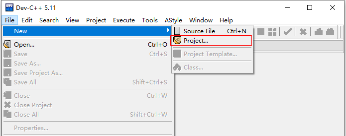
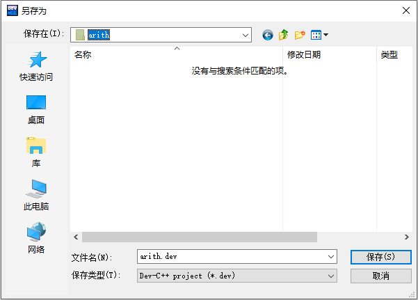
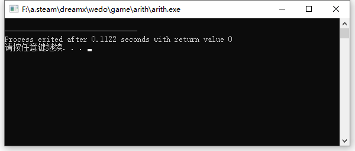

# 用Dev写项目

辽宁师范大学 &bull; 张大为@[https://daweizh.github.io/noip/](https://daweizh.github.io/noip/)

Dev Cpp 不但能写单片程序，还能写由多个程序文件组成的项目。通过写多个文件的项目我们可以更好的理解头文件的作用。

1. 新建一个项目   
  
2. 选择控制台应用程序   
  
3. 选择项目文件保存位置   
  
4. 向导生成的主程序    
  
5. 按F11键，先保存，后执行    
  


## 理解int argc和char** argv

控制台程序的执行方式是：

> 可执行程序名 参数列表（用空格分开）

例如

```shell
arith.exe hello world！
```

可执行程序arith.exe后面跟随两个参数hello和world!，空格是他们的分隔符。

我们可以通过如下程序读取命令行参数，并显示他们。

```c++ {.line-numbers}
#include <iostream>
using namespace std;

int main(int argc, char** argv) {
    
    cout << "argc=" << argc << endl;
    
    for(int i=0;i<argc;i++)
      cout << argv[i] << endl;
          
    return 0;
}
```

输出的内容是

```shell
argc=3
arith.exe
hello
world！
```

argc=3？没看错，确实是3，可行执行程序名自己也是输入参数的一部分，而且是第一个。


## 写我们自己的头文件

.h文件又叫头文件，放在程序开始的地方用#include指令引入的，有两种引入方法：

1. <> 引入，用于引入系统的、全局的头文件
2. “” 引入，用于引入自定义的、本地的头文件

\#include \<\> 和 \#include "" 都会在实现定义的位置查找文件，并将其包含。区别是:

1. 若 \#include "" 查找成功，则遮蔽 \#include <> 所能找到的同名文件；
2. 否则再按照 \#include <> 的方式查找文件。
3. 另外标准库头文件都放在 \#include <> 所查找的位置。
4. 一般来说 \#include <> 的查找位置是标准库头文件所在目录
5. \#include "" 的查找位置是当前源文件所在目录。不过这些都可由编译器调用参数等配置更改。
6. \<\>先去系统目录中找头文件，如果没有在到当前目录下找。所以像标准的头文件 stdio.h、stdlib.h等用这个方法。
7. 而""首先在当前目录下寻找，如果找不到，再到系统目录中寻找。 这个用于include自定义的头文件，让系统优先使用当前目录中定义的。

我们先写一个自己的头文件args.h。


```c++ {.line-numbers}
using namespace std;

void help(){
    cout << "Usage: arith.exe [--help]|[--disp h|v]|[--numb 20]" << endl;
    cout << endl;
    cout << "--help :display help" << endl;
    cout << "--disp :show problem model. You can select h(horizontal)  or v(vertical)" << endl;
    cout << "--numb :problem number" << endl;
    cout << endl;
    return ;	
}
```

保存成Header files格式


在主程序中用#include "args.h"引入，然后调用help()方法：

```c++ {.line-numbers}
#include <iostream>
#include "args.h" 
using namespace std;

int main(int argc, char** argv) {
    
    help();	
          
    return 0;
}
```

执行结果如下：


瞧！你也能写自己的头文件了！

## Dev的系统头文件到哪里找

1. iotream => Dev-Cpp-5.11\MinGW64\lib\gcc\x86_64-w64-mingw32\4.9.2\include\c++
2. cmath => Dev-Cpp-5.11\MinGW64\lib\gcc\x86_64-w64-mingw32\4.9.2\include\c++
3. math.h => Dev-Cpp-5.11\MinGW64\x86_64-w64-mingw32\include
4. bits/stdc++.h => Dev-Cpp-5.11\MinGW64\lib\gcc\x86_64-w64-mingw32\4.9.2\include\c++\x86_64-w64-mingw32\bits

找到这些头文件，并用记事本或notepad++打开瞧瞧，看看对你有没有一些启发？

