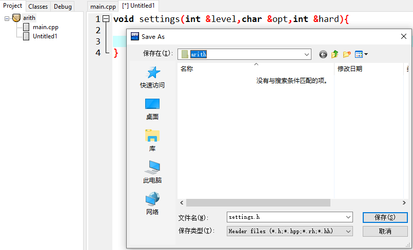
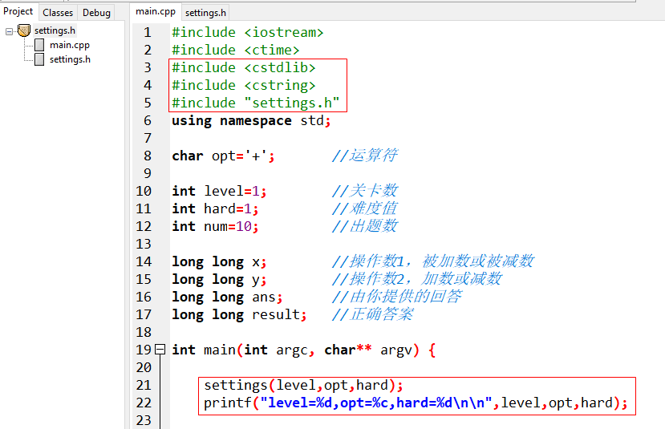

# 游戏设置

辽宁师范大学 &bull; 张大为@[https://daweizh.github.io/noip/](https://daweizh.github.io/noip/)

现在游戏可以随机出10道题做+法了，可以如何控制加数位数呢？想做-法怎么办？多长时间给出答案合适呢？

为了回答上述问题增加游戏设置功能。

## settings.h

鼠标右击arith项目，选择New File


输入如下程序代码

```c++ {.line-numbers}
void settings(int &level,char &opt,int &hard){
	
}
```

按Ctrl+s保存



输入文件名settings.h点击保存


在main.cpp中增加语句

```c++ {.line-numbers}
#include "settings.h"
```
和
```c++ {.line-numbers}
int level=1;    //关卡数 
int hard=1;     //难度值 
```

## 输入level

完善settings.h增加level的输入处理

```c++ {.line-numbers}
void settings(int &level,char &opt,int &hard){
    char c[200];  //接收输入字符串
	
    do{
        cout << "Please select level([1]-18):"; //提示输入游戏级别 
        gets(c);                                //读取输入信息 
        if(strlen(c)==0)                        //判断输入信息长度 
            level = 1;                          //如果输入信息长度为0，设缺省级别为1 
        else									 
            level = atoi(c);                    //否则将数字字符串转换成数值 
    }while(level<1 || level>18);                //如果输入的难度级别不是1~18要求重新输入 

}
```

测试一下，在main.cpp中增加如下语句



F11执行一下

```shell
Please select level([1]-18):6
level=6,opt=+,hard=1
```

## 选择运算符

继续完善settings.h中的settings函数

```c++ {.line-numbers}
void settings(int &level,char &opt,int &hard){
    char c[200];  //接收输入字符串

      ... ...

    do{
        printf("Please select operator([+],-):"); //提示选择+/- 
        gets(c);                                  //读入运算符 
        if(strlen(c)==0)                          //判断输入信息长度 
            opt = '+';                            //如果输入信息长度为0，设置缺省运算符为+ 
        else									
            opt = c[0];                           //否则读入第一个字符 
    }while(opt!='+' && opt!='-');                 //如果不是+/-运算符，要求重新输入 

}
```

回到main.cpp获得焦点，按F12重新构造全部，再按F11执行

```shell
Please select level([1]-18):
Please select operator([+],-):
level=1,opt=+,hard=1
```

增加了运算符选择功能

## 设置难度级别

继续完善settings.h中的settings函数

```c++ {.line-numbers}
void settings(int &level,char &opt,int &hard){
    char c[200];  //接收输入字符串

      ... ...

    do{
        printf("Please select Hard([1]-60):");  //提示选择难度级别 
        gets(c);                                //读入难度 
        if(strlen(c)==0)                        //判断输入信息长度 
            hard = 1;                           //如果输入信息长度为0，设置缺省难度为1 
        else
            hard = atoi(c);                     //否则将难度数字字符串转换为难度数值 
    }while(hard<1 || hard>60);                  //如果输入的难度范围不在1~60之间，要求重新输入 

}
```

回到main.cpp获得焦点，按F12重新构造全部，再按F11执行

```shell
Please select level([1]-18):
Please select operator([+],-):
Please select Hard([1]-60):
level=1,opt=+,hard=1
```

增加了运算符选择功能

