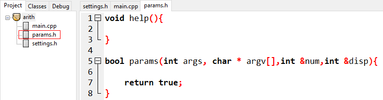
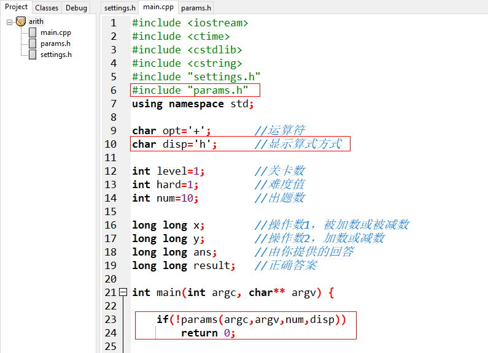

# 命令行参数

辽宁师范大学 &bull; 张大为@[https://daweizh.github.io/noip/](https://daweizh.github.io/noip/)

很多时候希望在程序启动时输入变化参数，我们把用这种方式输入的参数叫做命令行参数。

## params.h

在项目arith中创建新文件


在文件中输入如下内容

```c++ {.line-numbers}
void help(){
	
}

bool params(int args, char * argv[],int &num,char &disp){
	
    return true;
}
```

按Ctrl+s存盘，选择“保存类型”为“*.h”，文件名为params.h



在main.cpp中引入如下语句




## --help

考虑到在不同场合都可能出现提示软件使用方法的帮助信息，把显示help信息打包成一个独立的函数。

```c++ {.line-numbers}
void help(){
    printf("Usage: game.exe [--help]|[--disp h|v]|[--numb 20]\n\n");
    printf("--help :display help\n");
    printf("--disp :show model of question. You can select h(horizontal)  or v(vertical)\n");
    printf("--numb :question number\n\n");

    return ;	
}
```

在params函数中以--help参数或出错的形式显示帮助信息

```c++ {.line-numbers}
bool params(int args, char * argv[],int &num,char &disp){
    if(args>1){                               //如果命令行有参数输入 
        for(int i=1;i<args;i++){              //分析每个参数 
            if(strcmp(argv[i],"--help")==0){  //如果参数是--help 
                help();                       //显示帮助信息 
                return false;                 //结束游戏程序 
            }else {                           //有命令行参数输入，但不是我们要的 
                help();                       //显示帮助信息 
                return false;                 //结束游戏程序 
            }
        }	
    }

    return true;
}
```

回到main.cpp获得焦点，按F12重新构造全部。

按Ctrl+r并输入cmd命令，出现运行窗口


点击确定，出现命令终端


通过DOS命令（根据自己的具体情况），进入代码空间


测试命令行参数的执行情况：

1. 输入正确参数的情况
    ```shell
    F:\a.steam\dreamx\wedo\game\arith>arith --help
    Usage: game.exe [--help]|[--disp h|v]|[--numb 20]
    
    --help :display help
    --disp :show model of question. You can select h(horizontal)  or v(vertical)
    --numb :question number
    ```
2. 输入错误参数的情况
    ```shell
    F:\a.steam\dreamx\wedo\game\arith>arith 3
    Usage: game.exe [--help]|[--disp h|v]|[--numb 20]
    
    --help :display help
    --disp :show model of question. You can select h(horizontal)  or v(vertical)
    --numb :question number
    ```

## --disp

在params函数中增加对--disp的判断和处理


回到main.cpp获得焦点，按F12重新构造全部。

回到命令终端，测试--disp正确和错误情况

1. 正确输入参数情况
    ```shell
    F:\a.steam\dreamx\wedo\game\arith>arith --disp v
    Please select level([1]-18):
    Please select operator([+],-):
    Please select Hard([1]-60):
    level=1,opt=+,hard=1
    ... ...
    ```
2. --disp后没有参数情况
    ```shell
    F:\a.steam\dreamx\wedo\game\arith>arith --disp
    Usage: game.exe [--help]|[--disp h|v]|[--numb 20]
    
    --help :display help
    --disp :show model of question. You can select h(horizontal)  or v(vertical)
    --numb :question number
    ```
3. --disp后输入错误参数情况
    ```shell
    F:\a.steam\dreamx\wedo\game\arith>arith --disp 3
    Usage: game.exe [--help]|[--disp h|v]|[--numb 20]
    
    --help :display help
    --disp :show model of question. You can select h(horizontal)  or v(vertical)
    --numb :question number
    ```

## --numb

在params函数中增加对--numb的判断和处理


回到main.cpp获得焦点，按F12重新构造全部。

回到命令终端，测试--numb正确和错误情况

1. 正确输入参数情况
    ```shell
    F:\a.steam\dreamx\wedo\game\arith>arith --numb 5
    Please select level([1]-18):
    Please select operator([+],-):
    Please select Hard([1]-60):
    level=1,opt=+,hard=1
    ... ...
    ```
2. --disp后没有参数情况
    ```shell
    F:\a.steam\dreamx\wedo\game\arith>arith --numb
    Usage: game.exe [--help]|[--disp h|v]|[--numb 20]
    
    --help :display help
    --disp :show model of question. You can select h(horizontal)  or v(vertical)
    --numb :question number
    ```
3. --disp后输入错误参数情况
    ```shell
    F:\a.steam\dreamx\wedo\game\arith>arith --numb d
    Usage: game.exe [--help]|[--disp h|v]|[--numb 20]
    
    --help :display help
    --disp :show model of question. You can select h(horizontal)  or v(vertical)
    --numb :question number
    ```

## 检查参数设置情况

修改main.cpp


在main.cpp获得焦点，按F12重新构造全部。

回到命令终端，测试全部参数的正确性

```shell
F:\a.steam\dreamx\wedo\game\arith>arith --numb 5 --disp v
Please select level([1]-18):
Please select operator([+],-):
Please select Hard([1]-60):
level=1,opt=+,hard=1,disp=v,numb=5
```
