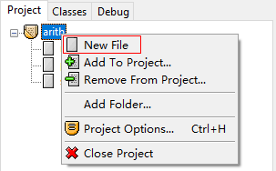
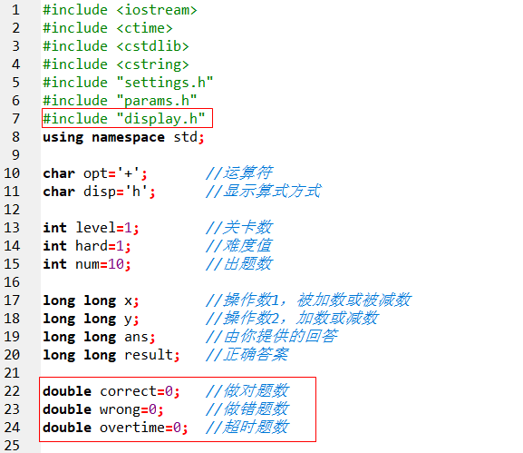

# 显示功能

辽宁师范大学 &bull; 张大为@[https://daweizh.github.io/noip/](https://daweizh.github.io/noip/)

现在你通过命令行可以设置出题的显示方式和每局的试题数了，但一些关键的显示问题仍然没有解决，如横式或竖式的显示问题，得分的显示问题等。

## display.h

鼠标右击arith项目，选择New File



输入如下程序代码

```c++ {.line-numbers}
void problem(char disp,long long x,char opt,long long y){

	  return ;
}

void score(double correct,double wrong,double overtime,double num){
	
	  return ;
}
```

按Ctrl+s保存


输入文件名display.h点击保存


在main.cpp中增加语句

```c++ {.line-numbers}
#include "display.h"
```

和

```c++ {.line-numbers}
double correct=0;	//做对题数 
double wrong=0;		//做错题数 
double overtime=0;	//超时题数 
```

如下图



## 显示试题

在display.h中完善如下函数

```c++ {.line-numbers}
void problem(char disp,long long x,char opt,long long y){
    switch(disp){
        case 'h':
            printf("%lld%c%lld=",x,opt,y);
            break;
        case 'v':
            printf("%25lld\n",x);
            printf("%c %23lld\n",opt,y);
            printf("-------------------------\n");
            printf("=");
            break;
    }
    return ;
}
```

按Ctrl+s保存display.h，回到main.cpp增加如下语句：


按Ctrl+s保存main.cpp，按F12重新构造全部。

进入命令终端，带--disp v运行游戏程序：

```shell
F:\a.steam\dreamx\wedo\game\arith>arith --disp v
Please select level([1]-18):
Please select operator([+],-):
Please select Hard([1]-60):
level=1,opt=+,hard=1,disp=v,numb=10

                    25224
+                    9978
-------------------------
=35202
Right!
```

## 显示得分及冠名

在display.h中继续完善如下函数：

```c++ {.line-numbers}
void score(double correct,double wrong,double overtime,double num){
    printf("right\twrong\tovertime \n");
    printf("--------------------------------- \n");
    printf("%d\t%d\t%d \n",(int)correct,(int)wrong,(int)overtime);

    int score = (correct+overtime*.5) * 100 / num;
    
    printf("\nscore=%d\t",score);
    if(score==100)
        printf("king\n");
    else if(score>=90)
        printf("excellent\n");
    else if(score>=80)
        printf("perfect\n");
    else if(score>=70)
        printf("ok\n");
    else if(score>=60)
        printf("low\n");
    else
        printf("bad\n");
    
    return ;
}
```

按Ctrl+s保存display.h，回到main.cpp增加如下语句：


按Ctrl+s保存main.cpp，按F12重新构造全部。

进入命令终端，带--disp v --numb 3运行游戏程序：

```shell
F:\a.steam\dreamx\wedo\game\arith>arith --disp v --numb 3
Please select level([1]-18):
Please select operator([+],-):
Please select Hard([1]-60):
level=1,opt=+,hard=1,disp=v,numb=3

                    27879
+                   32145
-------------------------
=3
Error!
                    23619
+                   27987
-------------------------
=3
Error!
                    21793
+                    9578
-------------------------
=3
Error!


right   wrong   overtime
---------------------------------
0       0       0

score=0 bad

F:\a.steam\dreamx\wedo\game\arith>
```

