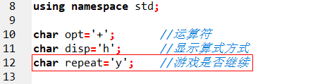
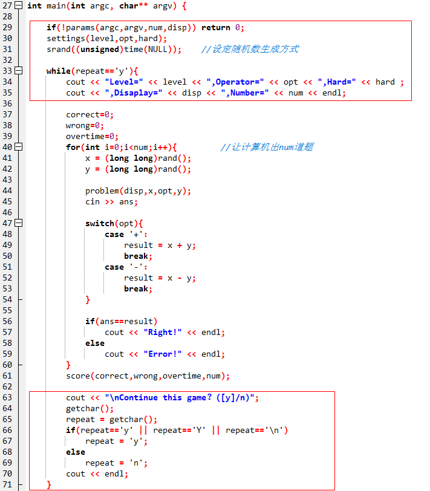
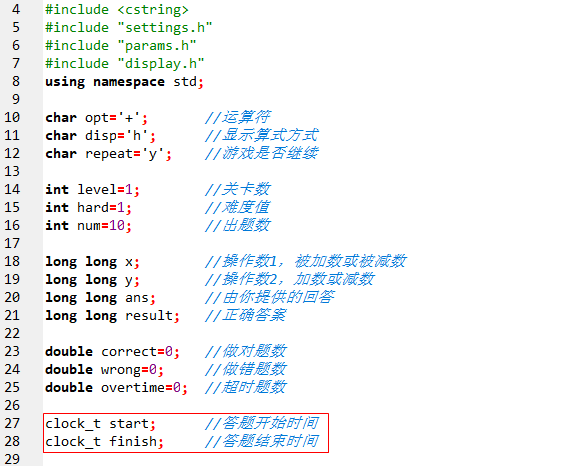
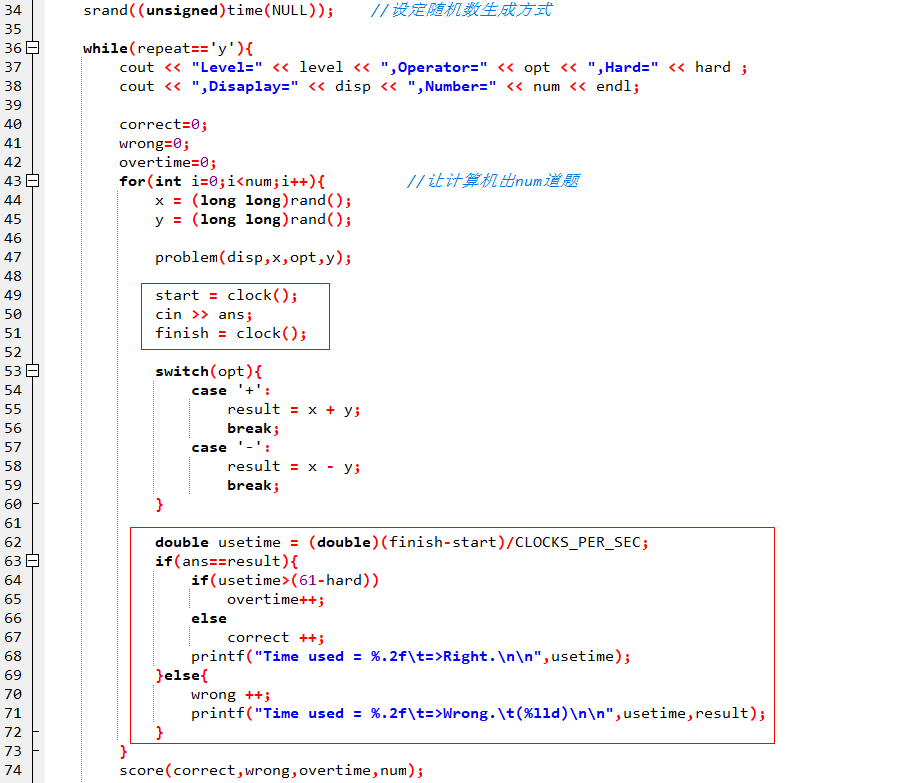
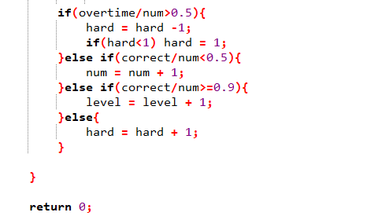
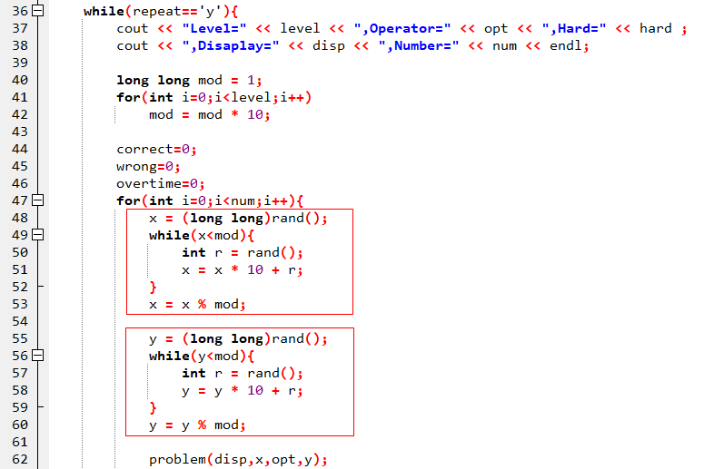

# 实现细节

辽宁师范大学 &bull; 张大为@[https://daweizh.github.io/noip/](https://daweizh.github.io/noip/)

到目前为止游戏基本能玩了，可是仍然有很多不方便的细节问题需要解决：

1. 游戏一局结束能否继续
2. 解题的时限问题
3. 根据玩家的战绩自动升/降级问题
4. 出题难度与游戏级别对应的问题

## 选择游戏是否继续

增加

```c++ {.line-numbers}
char repeat='y';	//游戏是否继续 
```

如图



修改main.cpp中的main函数增加游戏循环处理



按F12重新构造全部。

进入命令终端，带--disp v --numb 3运行游戏程序：

```shell
F:\a.steam\dreamx\wedo\game\arith>arith --disp v --numb 3
Please select level([1]-18):
Please select operator([+],-):
Please select Hard([1]-60):
Level=1,Operator=+,Hard=1,Disaplay=v,Number=3
                       13
+                   10879
-------------------------
=3
Error!
                      748
+                    3916
-------------------------
=3
Error!
                     4705
+                    5360
-------------------------
=3
Error!


right   wrong   overtime
---------------------------------
0       0       0

score=0 bad

Continue this game？([y]/n)
```

## 增加计时功能

增加

```c++ {.line-numbers}
clock_t start;		//答题开始时间 
clock_t finish;		//答题结束时间 
```

如图：



修改main.cpp中的main函数



按F12重新构造全部。

进入命令终端，带--disp v --numb 3运行游戏程序：

```shell
F:\a.steam\dreamx\wedo\game\arith>arith --disp v --numb 3
Please select level([1]-18):
Please select operator([+],-):
Please select Hard([1]-60):
Level=1,Operator=+,Hard=1,Disaplay=v,Number=3
                     1551
+                   27106
-------------------------
=4
Time used = 1.33        =>Wrong.        (28657)

                    26165
+                       9
-------------------------
=4
Time used = 1.98        =>Wrong.        (26174)

                    13206
+                   19841
-------------------------
=4
Time used = 0.86        =>Wrong.        (33047)

right   wrong   overtime
---------------------------------
0       3       0

score=0 bad

Continue this game？([y]/n)
```

## 解决游戏晋级/降级问题

在游戏重复循环结尾处增加如下代码



按F12重新构造全部。

进入命令终端，带--disp v --numb 3运行游戏程序：

```shell
F:\a.steam\dreamx\wedo\game\arith>arith --disp v --numb 3
Please select level([1]-18):
Please select operator([+],-):
Please select Hard([1]-60):
Level=1,Operator=+,Hard=1,Disaplay=v,Number=3
                     2547
+                   28570
-------------------------
=4
Time used = 1.57        =>Wrong.        (31117)

                     2481
+                   32056
-------------------------
=4
Time used = 1.12        =>Wrong.        (34537)

                    13423
+                    5078
-------------------------
=4
Time used = 1.15        =>Wrong.        (18501)

right   wrong   overtime
---------------------------------
0       3       0

score=0 bad

Continue this game？([y]/n)
```

## 解决游戏级别的精准性问题

修改出题方式提高游戏级别的精准性



按F12重新构造全部。

进入命令终端，带--disp v --numb 3运行游戏程序：

```shell
F:\a.steam\dreamx\wedo\game\arith>arith --disp v --numb 3
Please select level([1]-18):
Please select operator([+],-):
Please select Hard([1]-60):
Level=1,Operator=+,Hard=1,Disaplay=v,Number=3
                        3
+                       1
-------------------------
=4
Time used = 2.92        =>Right.

                        0
+                       1
-------------------------
=1
Time used = 2.16        =>Right.

                        6
+                       5
-------------------------
=11
Time used = 1.48        =>Right.

right   wrong   overtime
---------------------------------
3       0       0

score=100       king

Continue this game？([y]/n)
```
