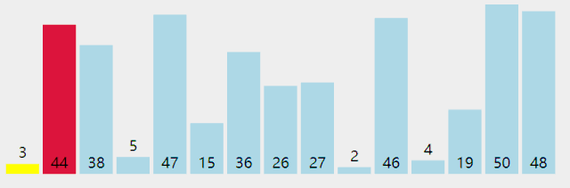
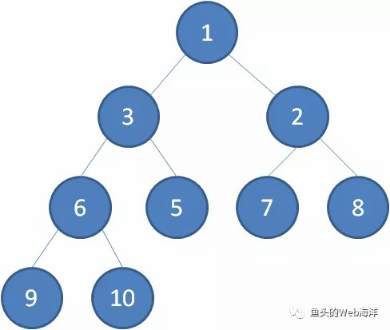
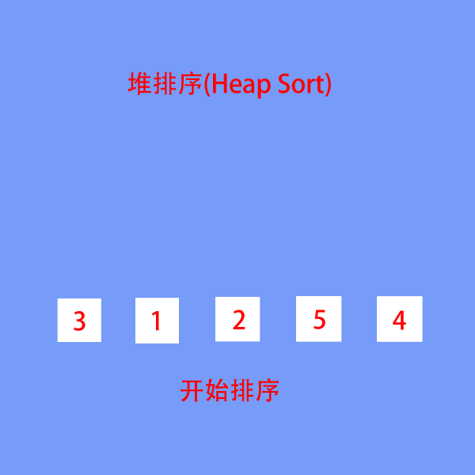
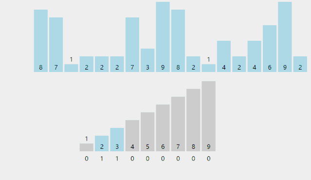

# 排序算法

辽宁师范大学 &bull; 张大为@[https://daweizh.github.io/noip/](https://daweizh.github.io/noip/)

除主函数外，本例中每个函数一个对应名字的.h文件，在主函数使用前用#include ""引入。当然，也可以把函数体直接在main前声明而不采取#incldue的方法。

- 主函数<label onclick="doShow(this)" style="cursor:pointer;">[+]</label>
	```c++ {.line-numbers .fold}
	#include <iostream>
	#include <cstring>
	#include <algorithm>

	#include "print.h"
	#include "selection.h"
	#include "bubble.h"
	#include "bubble2.h"
	#include "insertion.h"
	#include "bucket.h"
	#include "quick.h"
	#include "shell.h"
	#include "merge.h"
	#include "heap.h"
	#include "radix.h"
	#include "counting.h"
	#include "cocktail.h"

	using namespace std;


	int main() {
		int a[] = {39,6,1,8,20,40,4,4,42,18,50};
		int len = sizeof(a)/sizeof(int);
		int b[len];
		printf("00.%20s ","Initial Data:");
		print(a,len);

		printf("01.%20s ","Selection Sort:");
		memcpy(b,a,sizeof(a));
		selection(b,len);
		print(b,len);
		
		printf("02.%20s ","Bubble Sort:");
		memcpy(b,a,sizeof(a));
		bubble(b,len);
		print(b,len);

		printf("03.%20s ","Bubble2 Sort:");
		memcpy(b,a,sizeof(a));
		bubble2(b,len);
		print(b,len);
		
		printf("04.%20s ","Insertion Sort:");
		memcpy(b,a,sizeof(a));
		insertion(b,len);
		print(b,len);
		
		printf("05.%20s ","Bucket Sort:");
		memcpy(b,a,sizeof(a));
		bucket(b,len,100);
		print(b,len);
		
		printf("06.%20s ","Quick Sort:");
		memcpy(b,a,sizeof(a));
		quick(b,0,len-1);
		print(b,len);
		
		printf("07.%20s ","Shell Sort:");
		memcpy(b,a,sizeof(a));
		shell(b,len);
		print(b,len);

		printf("08.%20s ","Merge Sort:");
		memcpy(b,a,sizeof(a));
		int r[len];
		merge(b,r,0,len-1);
		print(b,len);

		printf("09.%20s ","Heap Sort:");
		memcpy(b,a,sizeof(a));
		heap(b,len);
		print(b,len);

		printf("10.%20s ","Radix Sort:");
		memcpy(b,a,sizeof(a));
		radix(b,len);
		print(b,len);

		printf("11.%20s ","Counting Sort:");
		memcpy(b,a,sizeof(a));
		counting(b,len);
		print(b,len);

		printf("12.%20s ","Cocktail Sort:");
		memcpy(b,a,sizeof(a));
		cocktail(b,len);
		print(b,len);
		
		return 0;
	}
	```
- print函数<label onclick="doShow(this)" style="cursor:pointer;">[+]</label>
	```c++ {.line-numbers .fold}
	void print(int a[],int length){
		printf("%d",a[0]);
		for(int i=1;i<length;i++)
			printf(",%d",a[i]);
		printf("\n");
	}
	```

## 1. 冒泡排序 (Bubble Sort)


- <label onclick="doShow(this)" style="cursor:pointer;">[+]</label>
	```c++ {.line-numbers .fold}
	void bubble(int a[],int length){	
		for(int i=length-1;i>=1;i--){	//n-1轮冒泡，n-1,n-2,...,1 
			for(int j=0;j<i;j++){		//冒泡的次数0,1,...,i-1 
				if(a[j]>a[j+1]){		//如果前面的大于后面的交换(从小到大)
					int tmp = a[j];
					a[j] = a[j+1];
					a[j+1] = tmp; 
				}
			}
		}
	}
	```

改进的冒泡排序：

- <label onclick="doShow(this)" style="cursor:pointer;">[+]</label>
	```c++ {.line-numbers .fold}
	void bubble2(int a[],int length){
		bool ok;
		for(int i=length-2;i>=0;i--){
			ok = true;
			for(int j=0;j<=i;j++){
				if(a[j]>a[j+1]){
					int tmp = a[j];
					a[j]=a[j+1];
					a[j+1]=tmp;
					ok=false;
				}
			}
			if(ok) break;
		}
	}
	```

## 2. 选择排序 (Selection Sort)


- <label onclick="doShow(this)" style="cursor:pointer;">[+]</label>
	```c++ {.line-numbers .fold}
	void selection(int a[],int length){
		for(int i=0;i<length;i++){ 			//找位置
			int k=i; 
			for(int j=i+1;j<length;j++){ 	//找包括i在内的最小的 
				if(a[j]<a[k])
					k = j;
			}
			if(k!=i){						//把找到的最小的交换到i位置 
				int temp = a[i];
				a[i] = a[k];
				a[k] = temp;
			}
		}
	}
	```

## 3. 插入排序 (Insertion Sort)


- <label onclick="doShow(this)" style="cursor:pointer;">[+]</label>
	```c++ {.line-numbers .fold}
	void insertion(int a[],int length){
		int j,k;
		for(int i=0;i<length;i++){
			for(j=i-1;j>=0;j--)
				if(a[j]<a[i])
					break;
			if(j!=i-1){
				int temp=a[i];
				for(k=i-1;k>j;k--)
					a[k+1] = a[k];
				a[k+1] = temp;
			}
		}
	}
	```

## 4. 希尔排序 (Shell Sort)


shell排序实际上是一种直接插入排序推广，其基本原理为其先将一组数分成若干组；此处应该注意，分组的方式不能几个几个紧挨着分组，而是采用每次所分组数均为素数且最后一次分组为1的方法。采用分组的好处是，在每次排序完后都是将小的数尽量往前面赶，大的数尽量往后面赶，最后一次排序直接采用直接插入排序。运用到了直接插入排序越有序有快的特性。

例如12、5、9、34、6、8、33、56、89、0、7、4、22、55、77的排序步骤如下：


- <label onclick="doShow(this)" style="cursor:pointer;">[+]</label>
	```c++ {.line-numbers .fold}
	void shell(int a[],int length){
		int drr[] = {5,3,1};
		int lend = sizeof(drr)/sizeof(drr[0]);
		for(int i=0;i<lend;i++){
			int gap = drr[i];
			for(int j = gap;j<length;j++){
				int temp = a[j];
				int k = 0;
				for(k = j-gap;k >= 0;k-=gap){
					if(a[k] > temp)
						a[k+gap] = a[k];
					else
						break;
				}
				a[k+gap] = temp;
			}
		}
	}
	```

## 5. 快速排序 (Quick Sort)



- <label onclick="doShow(this)" style="cursor:pointer;">[+]</label>
	```c++ {.line-numbers .fold}
	void quick(int a[],int left,int right){
		int mid,l=left,r=right,temp;
		
		mid = a[(l+r)/2];
		do{
			while(a[l]<mid) l++; 	//在左半部找比mid大的数 
			while(a[r]>mid) r--;	//在右半部找比mid小的数 
			if(l<=r){
				temp = a[l];
				a[l] = a[r];
				a[r] = temp;
				l++;
				r--;
			}		
		}while(l<=r);

		if(left<r) quick(a,left,r);
		if(l<right) quick(a,l,right);
	}
	```

## 6. 并归排序 (Merge Sort)


- <label onclick="doShow(this)" style="cursor:pointer;">[+]</label>
	```c++ {.line-numbers .fold}
	void merge(int a[],int r[],int left,int right){
		if(left==right)
			return ;
		
		int mid=(left+right)/2;
		merge(a,r,left,mid);
		merge(a,r,mid+1,right);
		
		int i=left,j=mid+1,k=left;
		while(i<=mid && j<=right){
			if(a[i]<=a[j]){
				r[k]=a[i];
				k++;
				i++;
			}else{
				r[k]=a[j];
				k++;
				j++;	
			}
		}
		while(i<=mid){
			r[k]=a[i];
			k++;
			i++;
		}	
		while(j<=right){
			r[k]=a[j];
			k++;
			j++;
		}
		for(i=left;i<=right;i++)
			a[i] = r[i];
	}
	```

## 7. 堆排序 (Heap Sort)






- <label onclick="doShow(this)" style="cursor:pointer;">[+]</label>
	```c++ {.line-numbers .fold}
	void adjust(int a[],int start,int end){
		int dad = start; //父节点指针 
		int son = dad * 2 + 1;	//子节点指针 
		while(son<=end){
			if(son+1<=end && a[son]<a[son+1])
				son++;	//比较两个子节点大小，选择小的
			if(a[dad]>a[son])
				return ;	//父节点比子节点小，调整完成
			else{
				int temp = a[dad];
				a[dad]=a[son];
				a[son]=temp;
				dad=son;
				son = dad *2+1;
			} 
		}
	}

	void heap(int a[],int length){
		for(int i=length/2-1;i>=0;i--) //初始化顶堆 
			adjust(a,i,length-1);
		for(int i=length-1;i>0;i--){
			int temp=a[0];
			a[0]=a[i];
			a[i]=temp;
			adjust(a,0,i-1);	//调整堆顶 
		}
	}
	```

## 8. 计数排序 (Counting Sort)



- <label onclick="doShow(this)" style="cursor:pointer;">[+]</label>
	```c++ {.line-numbers .fold}
	void counting(int a[],int length){
		int maxn=-1;
		
		for(int i=0;i<length;i++){
			if(a[i]>maxn)
				maxn = a[i];
		}
		
		
		int c[maxn+10],ranked[maxn+10];
		memset(c,0,sizeof(c));
		memset(ranked,0,sizeof(ranked));
			
		for(int i=0;i<length;i++)
			c[a[i]]++;

		for(int i=1;i<=maxn;i++)
			c[i] = c[i] + c[i-1];
		
		for(int i=length-1;i>=0;i--)
			ranked[--c[a[i]]] = a[i];
		
		for(int i=0;i<length;i++)
			a[i] = ranked[i];
	}
	```

## 9. 桶排序 (Bucket Sort)


- <label onclick="doShow(this)" style="cursor:pointer;">[+]</label>
	```c++ {.line-numbers .fold}
	void bucket(int a[],int length,int maxn){
		int b[maxn+1];
		memset(b,0,sizeof(b));
		for(int i=0;i<length;i++)
			b[a[i]]++;
		int p=0;
		for(int i=0;i<=maxn;i++)
			while(b[i]>0){
				a[p++] = i;
				b[i] --;
			}
	}
	```

## 10. 基数排序 (Radix Sort)


- <label onclick="doShow(this)" style="cursor:pointer;">[+]</label>
	```c++ {.line-numbers .fold}
	int findMaxNum(int a[],int n){
		int maxn = 0;
		for(int i=0;i<n;i++)
			if(a[i]>maxn)
				maxn = a[i];
		return maxn;
	}

	int getLoopTimes(int n){
		int count = 1;
		int temp = n/10;
		while(temp!=0){
			count ++;
			temp =temp / 10;
		}	
		return count;
	}

	void radixSort(int a[],int n,int p){
		int buckets[10][n];
		memset(buckets,0xf0f0f0f0,sizeof(buckets));
		
		int div = 1;
		for(int i=1;i<p;i++) div = div * 10;

		for(int i=0;i<n;i++){
			int row = (a[i]/div)%10;
			for(int j=0;j<n;j++){
				if(buckets[row][j]==0xf0f0f0f0){
					buckets[row][j]=a[i];
					break;
				}
			}
		}

		int k=0;
		for(int i=0;i<10;i++){
			for(int j=0;j<n;j++){
				if(buckets[i][j]!=0xf0f0f0f0){
					a[k]=buckets[i][j];
					buckets[i][j]=0xf0f0f0f0;
					k++;
				}else{
					break;
				}
			}
		}
	}

	void radix(int a[],int length){
		int maxNum = findMaxNum(a,length);
		int maxLoop = getLoopTimes(maxNum);
		
		for(int i=1;i<=maxLoop;i++){
			radixSort(a,length,i);		
		}
	}
	```

## 11. 特别的冒泡排序——鸡尾酒排序 (Cocktail Sort)


- <label onclick="doShow(this)" style="cursor:pointer;">[+]</label>
	```c++ {.line-numbers .fold}
	void cocktail(int a[],int length){
		int bottom =0,top = length-1,bound=0,temp;
		bool swapped = true;
		
		while(swapped){
			swapped = false;
			for(int i=bottom;i<top;i++){ //由底向上冒 
				if(a[i]>a[i+1]){
					temp = a[i];
					a[i]=a[i+1];
					a[i+1]=temp;
					swapped = true;
					bound = i;
				}
			}
			top = bound;
			for(int i=top;i>bottom;i--){
				if(a[i]<a[i-1]){
					temp = a[i];
					a[i]=a[i-1];
					a[i-1]=temp;
					swapped = true;
					bound = i;
				}
			}
			bottom = bound;
		}	
	}
	```

## 12. 排序算法比较

1. O(n²)的排序算法
    - 冒泡排序
    - 选择排序
    - 插入排序
    - 希尔排序
2. O(n log n) 的排序算法
    - 并归排序
    - 快速排序
    - 堆排序
3. 线性的排序算法
    - 计数排序
    - 桶排序
    - 基数排序


> 辽师张大为@[https://daweizh.github.io/csp/](https://daweizh.github.io/csp/)
