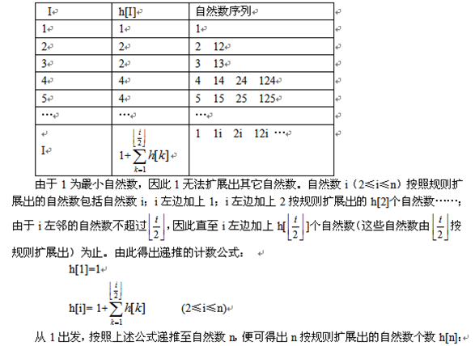

# Count 解题分析

## 方法一
看似可以用递归，f(n)=1+f(1)+f(2)+…+f(div/2)，但当n较大时重复计算量太大，时间应该为指数级。

## 方法二
用记忆化搜索，实际上是对方法一的改进。
设h[i]表示自然数i满足题意三个条件的数的个数。
如果用递归求解，会重复来求一些子问题。例如在求h[4]时，需要再求h[1]和h[2]的值。
现在我们用h数组记录在记忆求解过程中得出的所有子问题的解，当遇到重叠子问题时，直接使用前面记忆的结果。
 
## 方法三
用递推，用h(n)表示自然数n所能扩展的数据个数，
则h(1)=1, h(2)=2, h(3)=2, h(4)=4, h(5)=4, h(6)=6, h(7)=6, 
h(8)=10, h(9)=10.
分析以上数据，可得递推公式：h(i)=1+h(1)+h(2)+…+h(i/2)。
此算法的时间度为O(n*n)。

设h[i]-i按照规则扩展出的自然数个数(1≤i≤n)。下表列出了h[i]值及其方案：

例如要求f(6)，经过分析，
我们知道：f(6)=f(1)+f(2)+f(3)+1，
也就是说，f(6)的答案数量是在它之前可以取的所有自然数的答案数量之和（6之前可以取1，2，3三个自然数），
最后加1是指数字6本身也是一个答案；
所以，我们可以知道f(n)=f(1)+f(2)+......f(trunc(n/2))+1；
因此，要求f(n)，我们只需用上述公式编一个递推过程，
把f(2)到f(n)全部求出即可，对于f(1000)也不超过1秒就能得到结果。

## 方法四
是对方法三的改进，我们定义数组s，
s(x)=h(1)+h(2)+…+h(x),
h(x)=s(x)-s(x-1)，
此算法的时间复杂度可降到O(n)。

## 方法五
还是用递推，只要作仔细分析，其实我们还可以得到以下的递推公式: 
(1)当i为奇数时，h(i)=h(i-1);
(2)当i为偶数时,h(i)=h(i-1)+h(i/2).

## 方法六
对于f(7)=f(6)是显而易见的，也即f(2n+1)=f(2n)。那么，f(8)和f(7)之间有什么关系呢？
分析可知：f(8)和f(7)的差别是，f(8)除了包含f(7)的所有情况外，还要多加上f(4)，
即：f(8)=f(7)+f(4)。因此可得：f(2n)=f(2n-1)+f(n)。只需据此编一个递归小过程或者用递推方法即可。

参考文献：

1. http://www.cnblogs.com/geek-007/p/4471383.html
