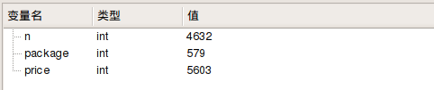
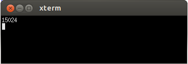

# 22 普及组 2016 复赛解题过程

## 22.1 pencil

### step1

用测试数据 pencil1.ans 的数据作为输出，编写主程序框架。

```cpp
#include <iostream>
#include <cstdio>
using namespace std;

int main(){
    freopen("pencil.in","r",stdin);
    freopen("pencil.out","w",stdout);

    cout << 15024 << endl;
    
    return 0;
}
```

### step2

编写对拍程序，通过测试点 1。

```sh
#!/bin/bash
i=1
while [ $i -le 10 ]
do
    echo score$i
    cp -f score$i.in score.in
    ./score
    if diff score$i.ans score.out ; then
        echo Ac
    fi
    i=$(($i+1))
done
```

执行对拍程序，观测测试结果。

```sh
$ cd ~/noip/2017/score/
$ sh ./score.sh 
score1
Ac
```

只有 score1 测试数据通过，可得 10 分。

### step3

复制 pencil1.in 作为输入测试数据 pencil.in。

```cpp
4632
579 7249
579 1878
579 5603
```

### step4

设计输入数据变量及其对应的数据类型。
设计数据读取及其运算结构。

```cpp
#include <iostream>
#include <cstdio>
using namespace std;

int n,package,price;

int main(){
    freopen("pencil.in","r",stdin);
    
    cin >> n;
    
    for(int i=0;i<3;i++){
        cin >> package >> price;
    }

    cout << 15024 << endl;
    
    return 0;
}
```

观察数据读取情况。



### step5

增加中间变量，组织算法逻辑，按`Ctrl+F5`观察计算结果。

```cpp
#include <iostream>
#include <cstdio>
using namespace std;

int n,package,price;
int minimum,m;

int main(){
    freopen("pencil.in","r",stdin);
    
    cin >> n;
    minimum = n * 10000;
    
    for(int i=0;i<3;i++){
        cin >> package >> price;
        
        if(n%package==0){
            m = n/package * price;
        }else{
            m = (n/package + 1) * price;
        }
        
        if(m < minimum){
            minimum = m;
        }
    }

    cout << minimum << endl;
    
    return 0;
}
```



### step6

增加输出重定向，完成程序，按`F7`编译通过。
按`Ctrl+F5`执行，将计算机结果 pencil.out 与 pencil1.ans 比较，看是否正确。

```cpp
#include <iostream>
#include <cstdio>
using namespace std;

int n,package,price;
int minimum,m;

int main(){
    freopen("pencil.in","r",stdin);
    freopen("pencil.out","w",stdout);
    
    cin >> n;
    minimum = n * 10000;
    
    for(int i=0;i<3;i++){
        cin >> package >> price;
        
        if(n%package==0){
            m = n/package * price;
        }else{
            m = (n/package + 1) * price;
        }
        
        if(m < minimum){
            minimum = m;
        }
    }

    cout << minimum << endl;
    
    return 0;
}
```

pencil.out

```cpp
15024
```

### step7

编写对拍程序，检测通过测试点情况。

```sh
#!/bin/bash
i=1
while [ $i -le 20 ]
do
    echo pencil$i
    cp -f pencil$i.in pencil.in
    ./pencil
    if diff pencil$i.ans pencil.out ; then
        echo Ac
    fi
    i=$(($i+1))
done
```

### step8

执行对拍程序，查看结果，Ac 为通过的测试用例。

```sh
$ cd ~/noip/2016/pencil/
$ sh ./pencil.sh
```

执行结果如下：

```sh
pencil1
Ac
pencil2
Ac
pencil3
Ac
pencil4
Ac
pencil5
Ac
pencil6
Ac
pencil7
Ac
pencil8
Ac
pencil9
Ac
pencil10
Ac
pencil11
Ac
pencil12
Ac
pencil13
Ac
pencil14
Ac
pencil15
Ac
pencil16
Ac
pencil17
Ac
pencil18
Ac
pencil19
Ac
pencil20
Ac
```

## 22.2 date

### step1

用测试数据 date1.ans 的数据作为输出，编写主程序框架。

```cpp
#include <iostream>
#include <cstdio>
using namespace std;

int main(){
    freopen("date.in","r",stdin);
    freopen("date.out","w",stdout);

    cout << 14 << endl;

    return 0;
}
```

## 22.3 port

### step1

用测试数据 port1.ans 的数据作为输出，编写主程序框架。

```cpp
#include <iostream>
#include <cstdio>
using namespace std;

int main(){
    freopen("port.in","r",stdin);
    freopen("port.out","w",stdout);

    cout << 6 << endl;
    
    return 0;
}
```

## 22.4 magic

### step1

用测试数据 magic1.ans 的数据作为输出，编写主程序框架。

```cpp
#include <iostream>
#include <cstdio>
using namespace std;

int main(){
    freopen("magic.in","r",stdin);
    freopen("magic.out","w",stdout);

    cout << "0 0 0 0" << endl;

    return 0;
}
```
