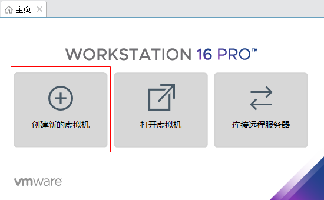
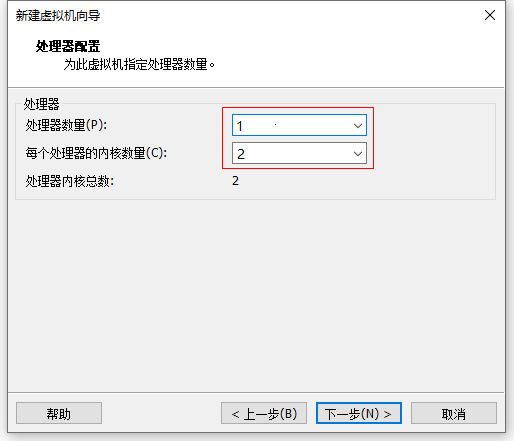
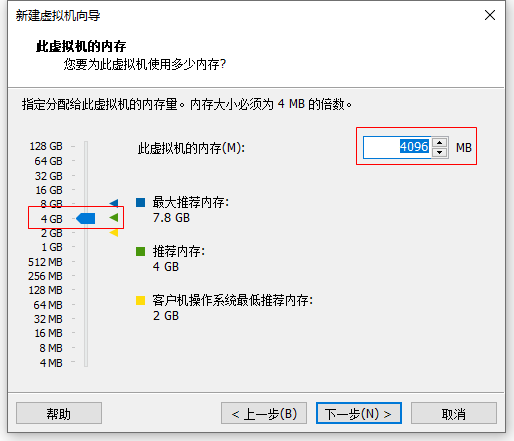
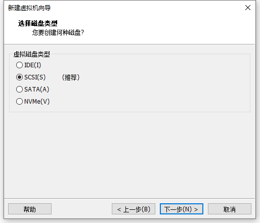

## 创建虚拟计算机

虚拟机创建完成后，按 ubuntu-noi-v2.0 安装要求，并未接入网络。

1. 启动 VMware Workstation
2. 主页 > 创建新的虚拟机
    
3. 欢迎使用新建虚拟机向导
    
    - \(·) 自定义（高级）
    - 下一步
4. 选择虚拟机硬件兼容性
    
    - 下一步
5. 安装客户机操作系统
    
    - \(·) 稍后安装操作系统
    - 下一步
6. 选择客户机操作系统
    
    - \(·) Linux(L)
    - Ubuntu 64 位
    - 下一步
7. 命名虚拟机
    
    - 虚拟机名称：noi-2.0
    - 位置： D:/vms/noi-2.0
    - 下一步
8.  处理器配置
    
    - 处理器数量
    - 每个处理器的内核数量
    - 下一步
9. 此虚拟机的内存
    
    - 此虚拟机的内存： 4096MB
    - 下一步
10. 网络类型
    
    - \(·) 使用网络地址转换 (NAT)
    - 下一步
11. 选择 I/O 控制器类型
    
    - \(·) LSI Logic(L)
    - 下一步
12. 选择磁盘类型
    
    - \(·) SCSI
    - 下一步
13. 选择磁盘
    
    - \(·) 创建新虚拟磁盘
    - 下一步
14. 指定磁盘容量
    
    - 最大磁盘大小：120GB
    - \(·) 将虚拟磁盘存储为单个文件 (O)
    - 下一步
15. 指定磁盘文件
    
    - 下一步    
16. 已准备好创建虚拟机
    
    - 自定义硬件
17. 硬件 > 网络适配器
    
    - \[ ] 启动时链接
    - \(·) NAT 模式 (N): 用于共享主机的 IP 地址
    - 关闭
18. 硬件 > 新 CD/DVD (SATA)
    
    - \[√] 启动时链接
    - \(·) 使用 ISO 映像文件
    - 关闭
19. 已准备好创建虚拟机
    
    - 完成
