## 安装 ubuntu-noi-v2.0 操作系统

安装过程需要断开网络！

1. noi-2.0 > 开启此虚拟机
    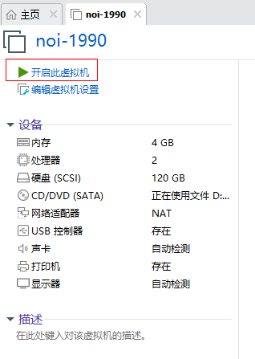
2. 您在运行该虚拟机时启动了侧通道缓解。
   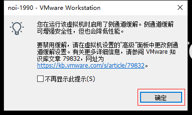
   - 确定
3. Checking disks
   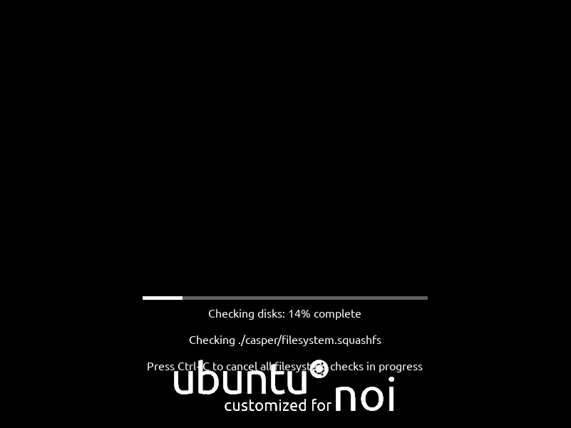
4. Welcome
   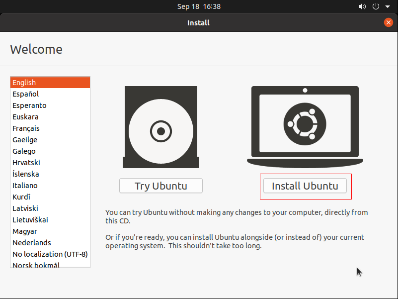
   - Install Ubuntu
5. Keyboard layout
   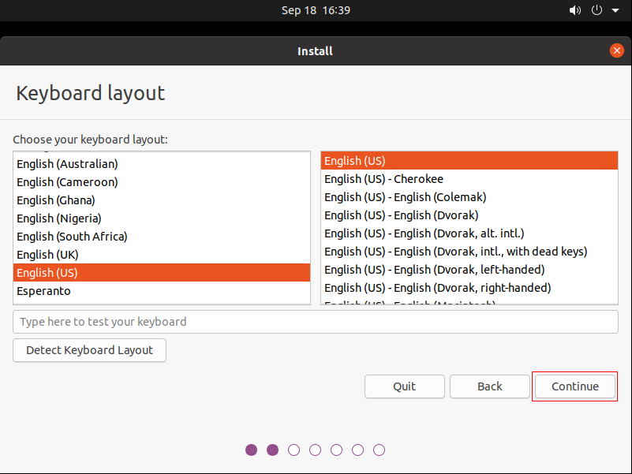
   - Continue
6. Updates and other software
   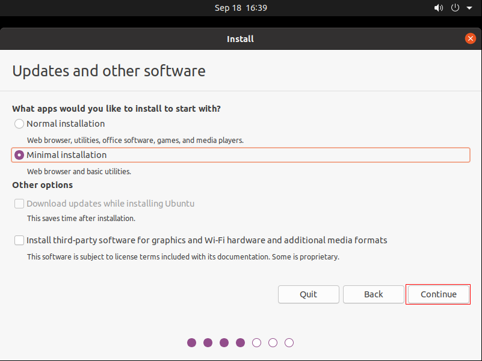
   - \(·) Minimal Installation
   - Continue
7. Installation type
   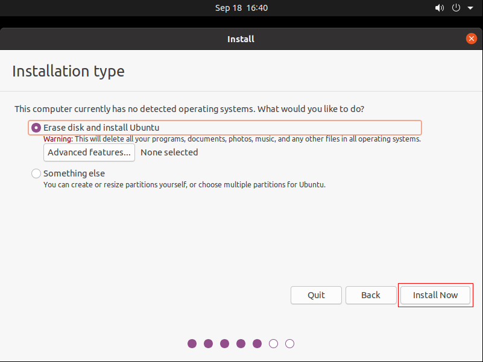
   - \(·) Erase and install Ubuntu
   - Install Now
8. Write the changes to disks?
   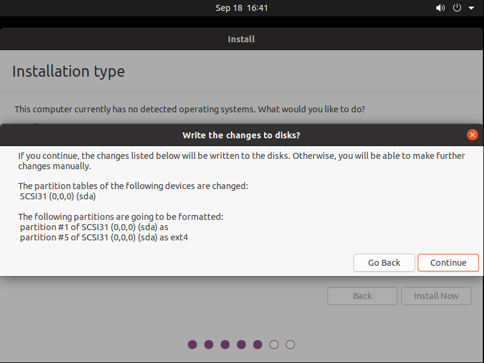
   - Continue
9. Where are you?
    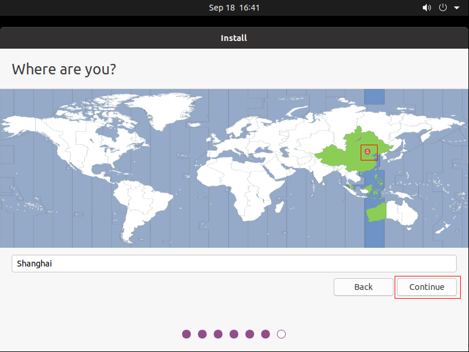
    - Shanghai
    - Continue
10. Who are you?
    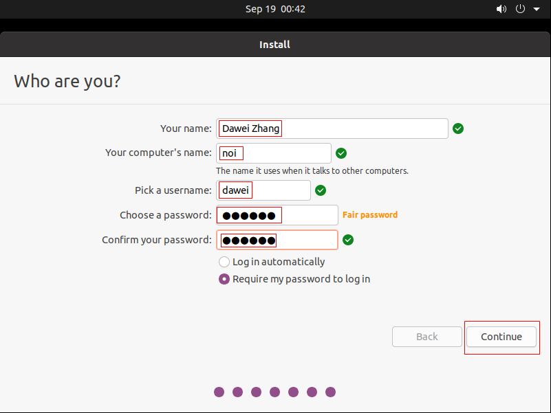
    - Your name: Jack Ma
    - Your computer's name: noi
    - Pick a username: jack
    - Choose a password: 123456
    - Confirm your password: 123456
    - \(·) Require my password to login in
    - Continue
11. Welcome to Ubuntu
    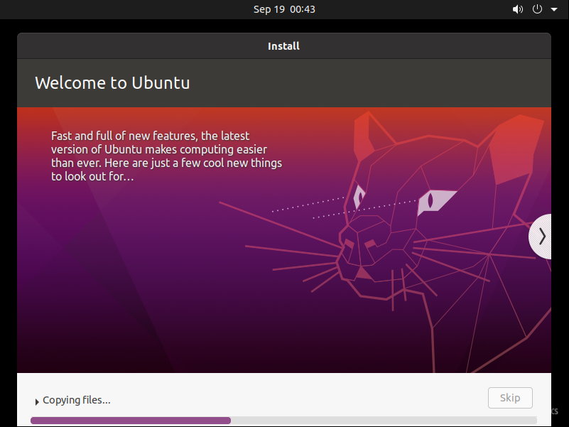
12. Installation Complete
    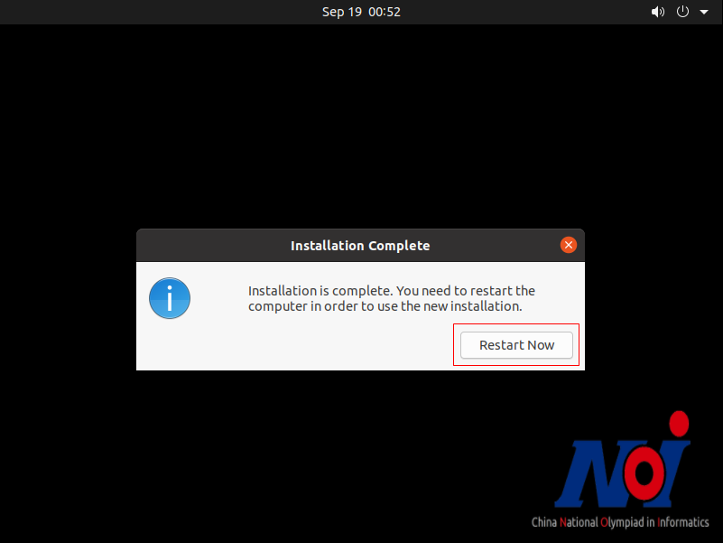
    - Restart Now
13. Please remove the installation medium, then press ENTER
    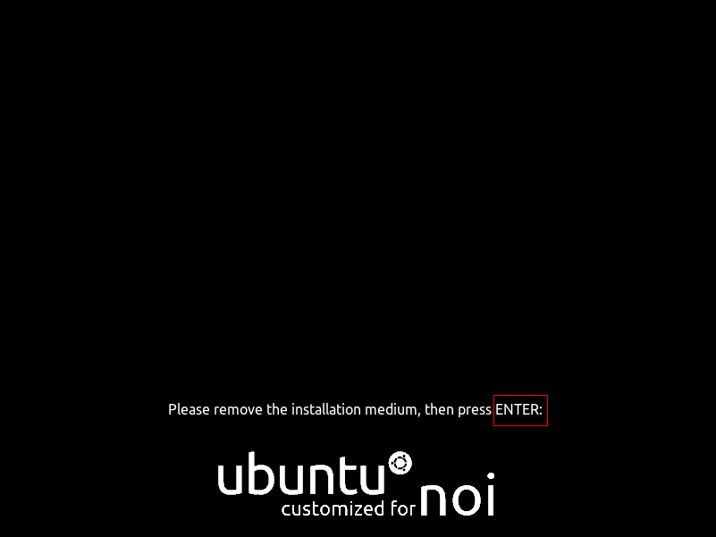
    - ENTER
14. Select username
    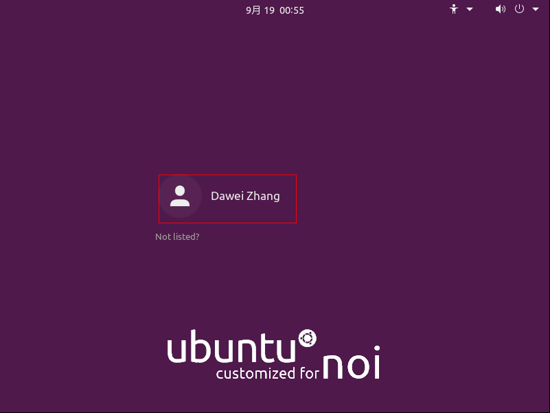
15. Input password
    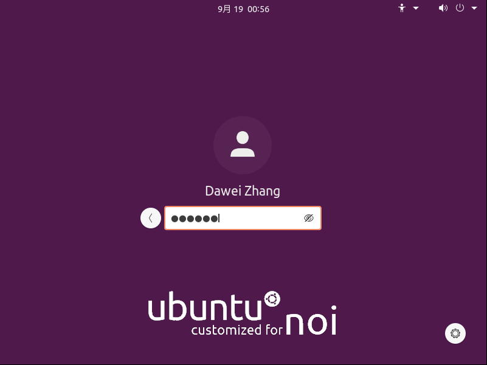
16. Power off
    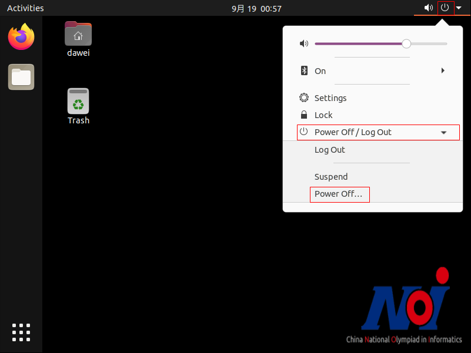
17. Power off
    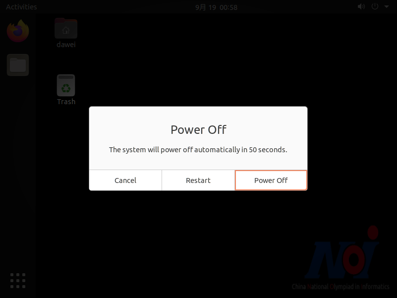
