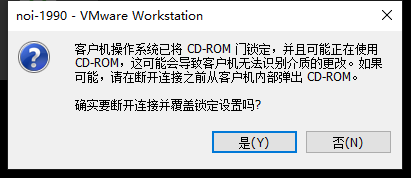
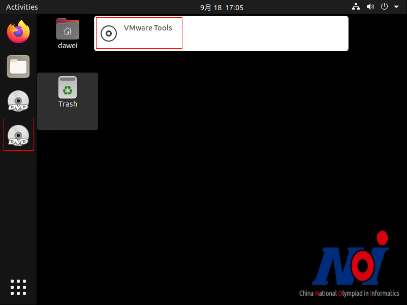
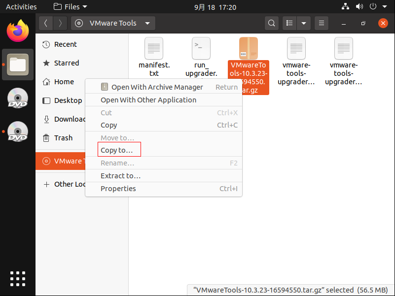
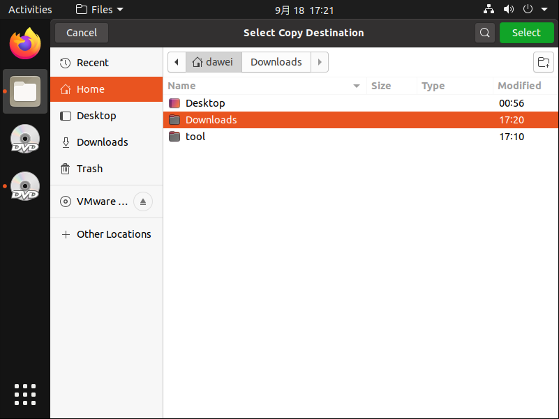
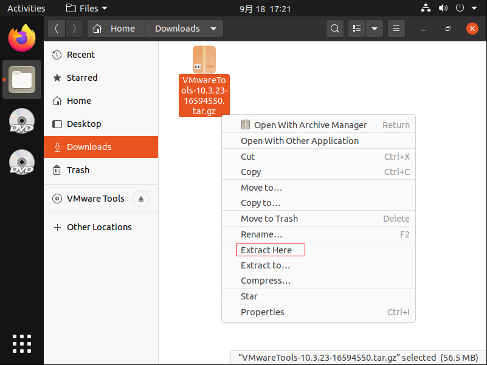
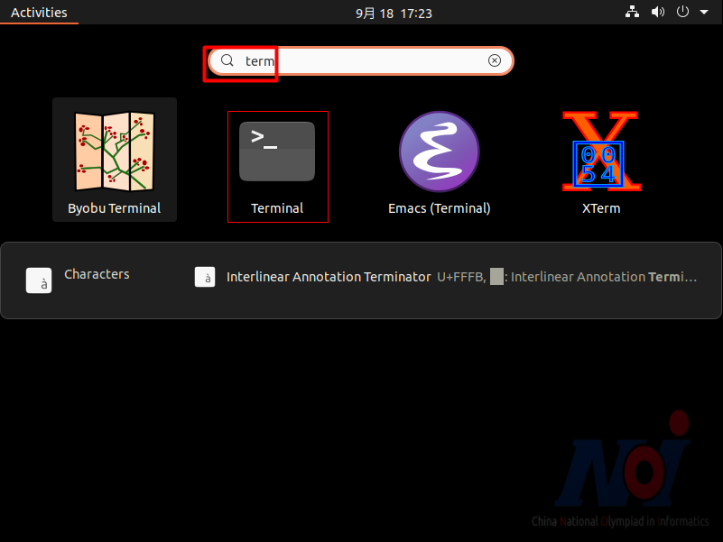
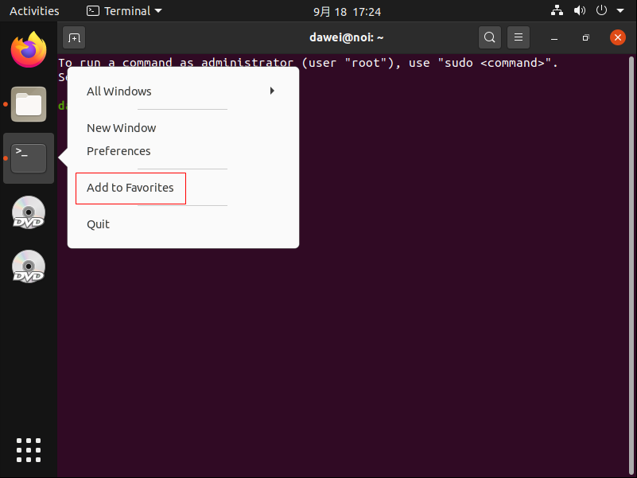
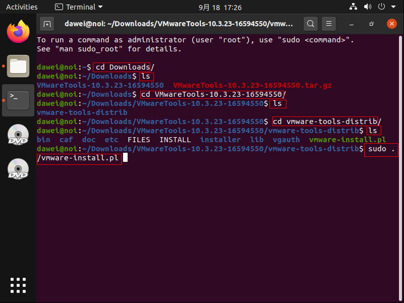
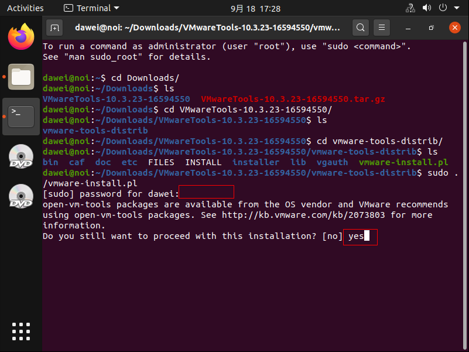

## 安装 VMware Tools

1. 启动并登录 noi-2.0
2. VMware Workstation > 虚拟机 > 安装 VMware Tools
    
3. 确实要断开链接并覆盖锁定设置吗？
    
    - 是
4. 等待出现 VMware Tools 光盘标签，鼠标左键双击该标签
    
5. 选择  VMwareTools-10.3.23-16594550.tar.gz > 鼠标右键 > Copy to ...
    
6. Home > Downloads > Select
    
7. 双击 Downloads > 鼠标右键 VMwareTools-10.3.23-16594550.tar.gz > Extract Here
    
8. 解压后出现 VMwareTools-10.3.23-16594550 文件夹
    
    - 点击屏幕左下角应用按钮
9. 搜索框输入：term
    
    - 选择 Terminal
10. 鼠标右键左侧 Terminal 图标 > Add to Favorites
    
11. 执行 Linux 命令
    
    - cd Downloads
    - ls
    - cd VMwareTools-10.3.23-16594550
    - ls
    - cd vmware-tools-distrib
    - ls
    - sudo ./vmware-install.pl
11. 执行安装过程
    
    - Do you still want to proceed with this installation? [no] yes
    - Enter
12. 效果
    - 屏幕自适应
    - 鼠标和键盘变快
