## Code::Blocks 编程

1. 启动 noi-2.0 虚拟机
2. 点击左下角应用按钮 
    
3. 点击 Code::Bl... 按钮
    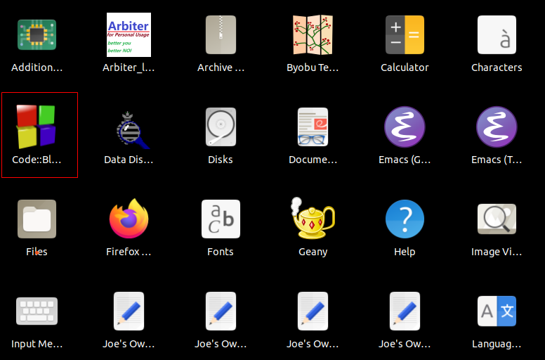
4. Complilers auto-detection
    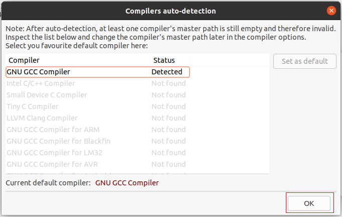
    - GNU GCC Compiler
    - OK
5. 左侧 Code::Blocks 图标 > 鼠标右键 > Add to Favorites
    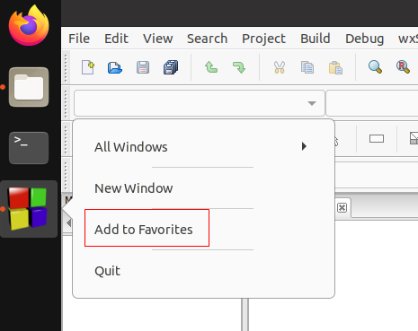
6. Management > Files > home > jack
    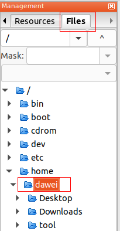
7. jack > 鼠标右键 > New directory...
    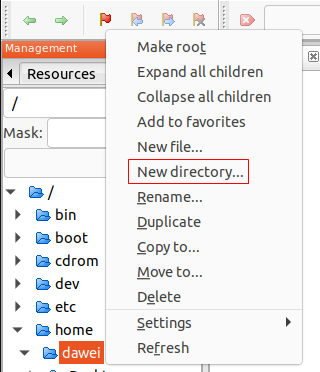
8. Input Text
    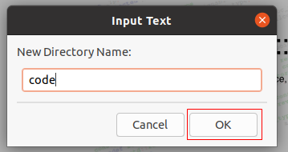
    - New Directory Name: code
    - OK
9. code > 鼠标右键 > Make root
    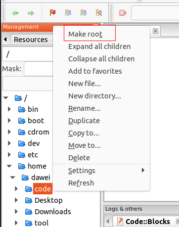
10. /home/jack/code/ > 鼠标右键 > New file...
    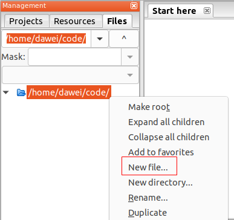
11. Input Text
    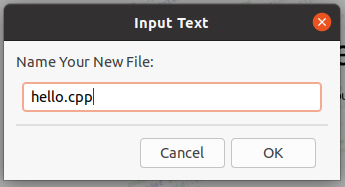
    - Name Your New File: hello.cpp
    - OK
12. 鼠标左键双击 hello.cpp > What to do?
    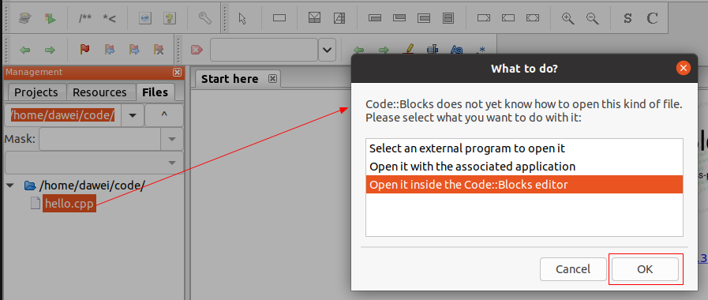
    - Open it inside the Code::Blocks editor
13. edit hello.cpp program code
    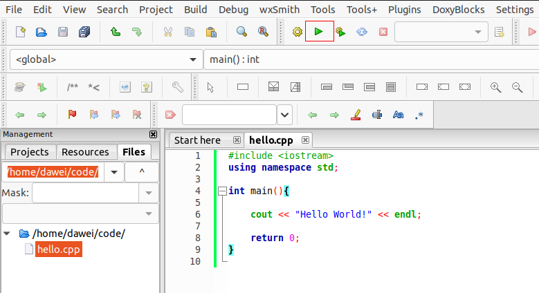
    - 点击运行按钮
14. Do you want to build it now?
    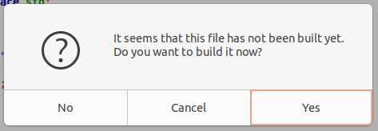
    - Yes
15. 运行结果出现在终端窗口
    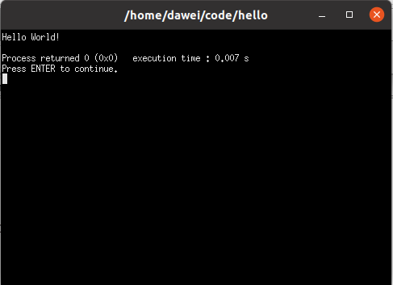
    - 按回车键关闭终端窗口
