## 安装 VMware Workstation Pro

1. 鼠标左键双击 VMware-workstation-full-16.2.4-20089737.exe，启动安装过程
2. 你要允许此应用对你的设备进行更改吗？
    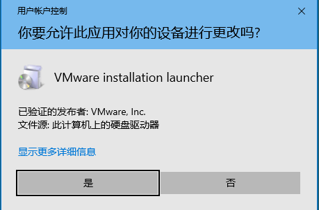
   - 是
3. 欢迎使用 WMware Workstation Pro 安装向导
    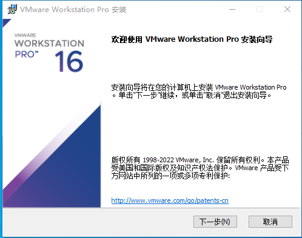
   - 下一步
4. 最终用户许可协议
    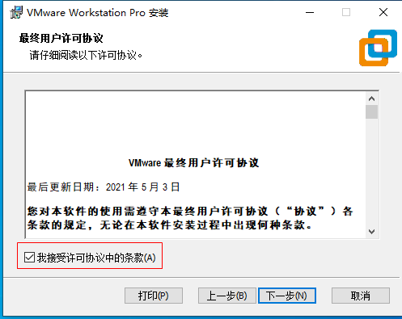
   - \[√] 我接受许可协议中的条款
   - 下一步
5. 自定义安装
    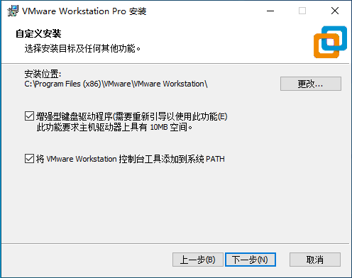
   - \[√] 增强型键盘驱动程序
   - \[√] 将 WMware Workstation 控制台工具添加到系统 PATH
   - 下一步
6. 用户体验设置   
    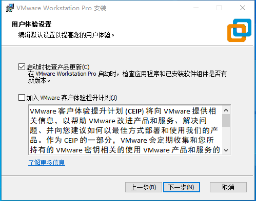
   - \[√] 启动时检查产品更新
   - \[ ] 加入 WMwarfe 客户体验提升计划
   - 下一步
7. 快捷方式
    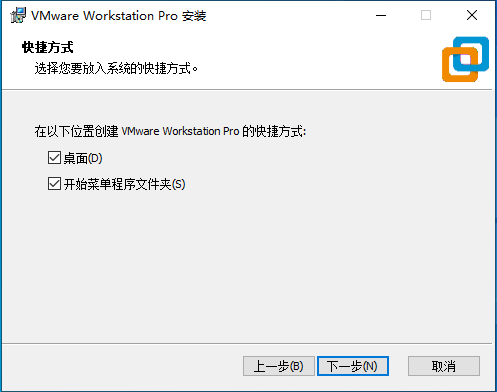
   - \[√]
   - 下一步
8. 已准备好安装 VMware Workstation Pro
    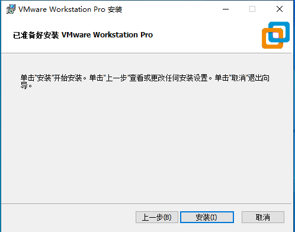
   - 安装
9. 正在安装 VMware Workstation Pro
    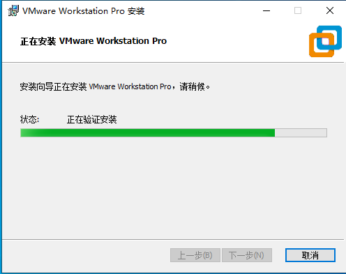
10. VMware Workstation Pro 安装向导已完成
    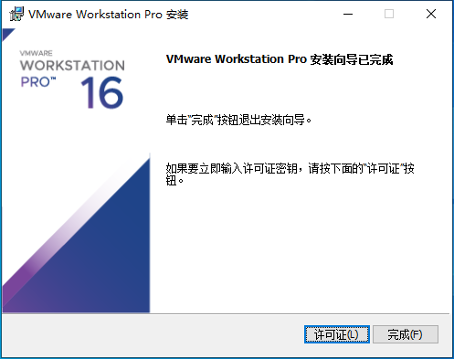
    - 许可证
11. 输入许可证秘钥
    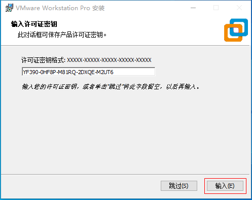
    - YF390-0HF8P-M81RQ-2DXQE-M2UT6
    - 输入
12. VMware Workstation Pro 安装向导已完成
    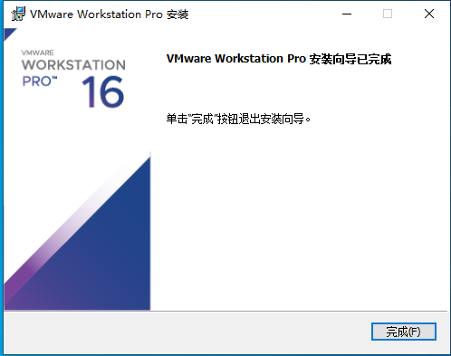
    - 完成
13. 重新启动系统提示
    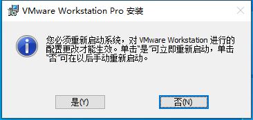
    - 否
14. 鼠标左键双击 WMware Workstation Pro 桌面图标，启动 WMware Workstation
    
15. WMware Workstation 启动后的界面
    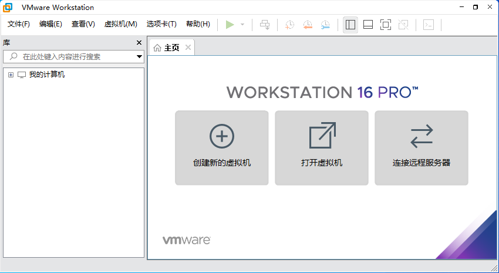
