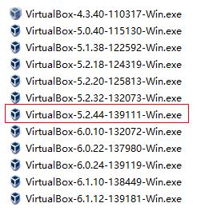
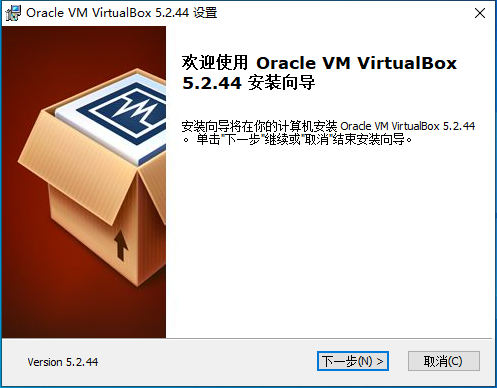
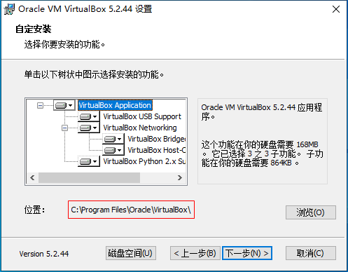
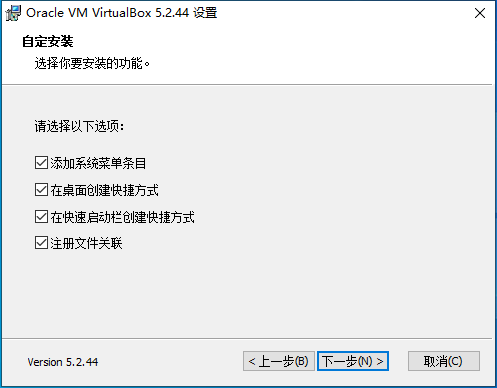
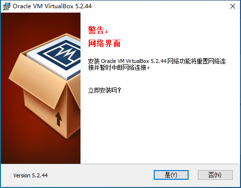
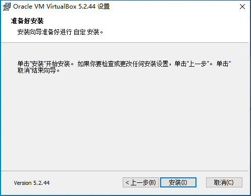
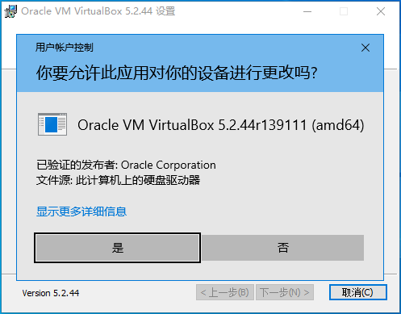
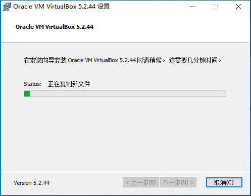
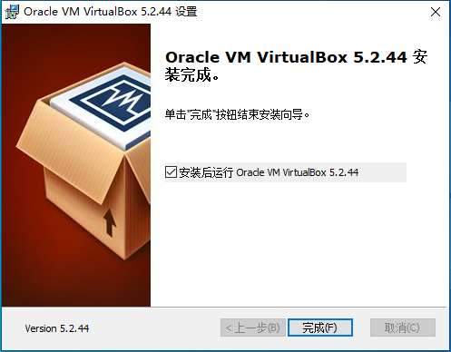
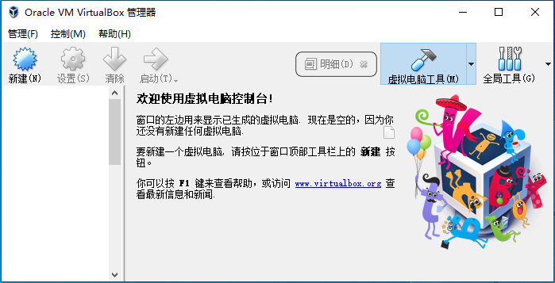

# 安装VirtualBox

辽宁师范大学 &bull; 张大为@[https://daweizh.github.io/noip/](https://daweizh.github.io/noip/)

1. 选择和noilinux-141相兼容的VirtualBox，双击安装
  
2. 点击“下一步”继续
  
3. 接受默认选项，注意软件的安装位置，点击“下一步”
  
4. 接受默认选项，点击“下一步”
  
5. 接受警告，点击“是”
  
6. 点击“安装”，开始安装VirtualBox
  
7. 允许Windows安装该软件，选择“是”
  
8. 等待安装向导复制文件
  
9. 接受“安装后运行”，点击“完成”
  
10. 正常运行的VirtualBox管理器软件
  

