# 导入noilinux

辽宁师范大学 &bull; 张大为@[https://daweizh.github.io/noip/](https://daweizh.github.io/noip/)

## 导入noilinux的VirtualBox导出包

1. 选择VirtualBox管理器的“导入虚拟电脑”
  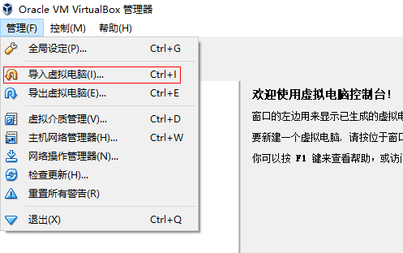
2. 选择noilinux导入包
  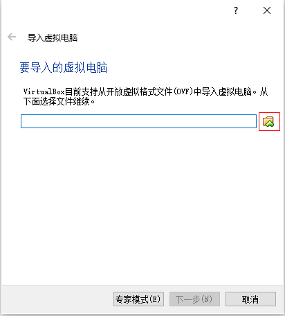
3. 找到vb-noilinux-141-x86.ova导入包
  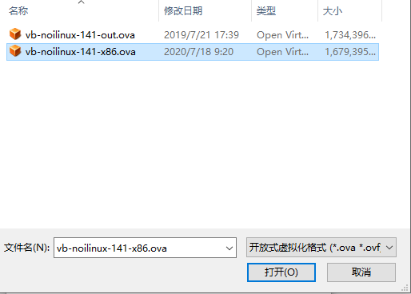
4. 注意导入包的路径，点击“下一步”
  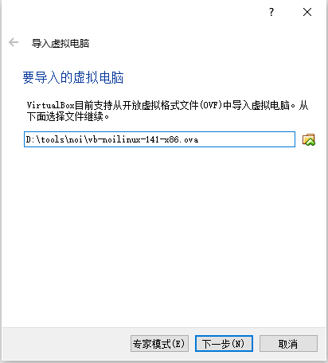
5. 查看导入noilinux虚拟机的各项参数
  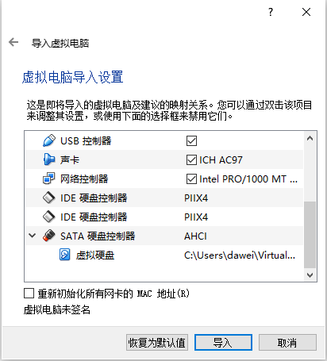
6. 鼠标双击虚拟硬盘的保存位置进行修改
  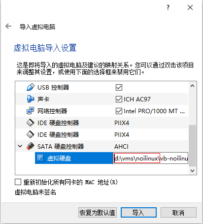
7. 修改虚拟硬盘的保存位置，注意修改到的位置
  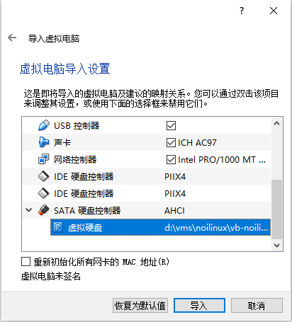
8. 等待导入完成
  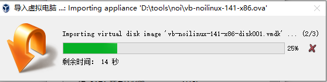

## 设置导入的noilinux虚拟机

导入完成后不要急着启动虚拟机，通过设置，调整虚拟机的各项参数以适应你的宿主计算机（你的真机）的各项指标。

1. 选中noilinux虚拟机，点击“设置”
  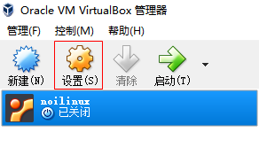
2. 选择“常规”，“高级”，对“共享粘贴板”和“拖放”进行设置
  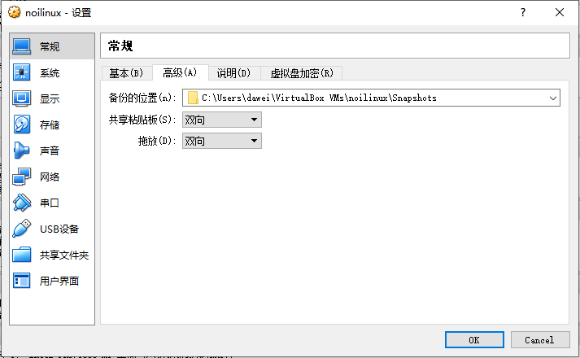
3. 选择“系统”，“主板”，对内存大小进行调整。注意颜色的分界线。
  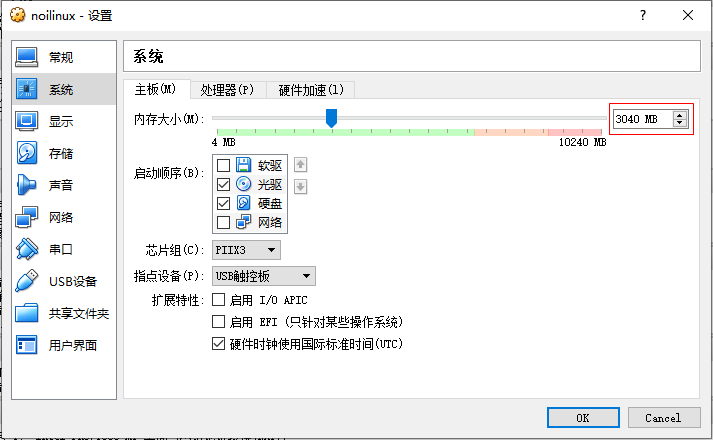
4. 选择“系统”，“处理器”，观察“扩展特性”，需要选择。
  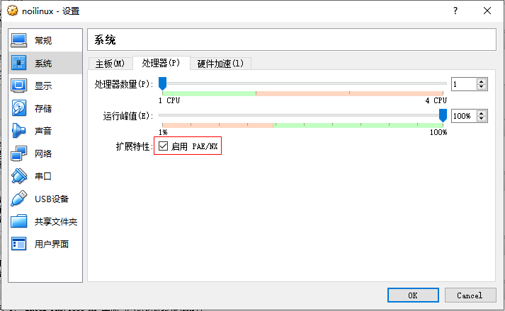

## 启动设置好的noilinux

虚拟机的设置只需要进行一次，设置好以后就可以重复启动了。

1. 选中noilinux虚拟机，点击“启动”
  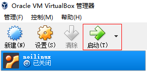
2. 如果出现下面界面，停留在第一个选型，按回车键启动虚拟机
  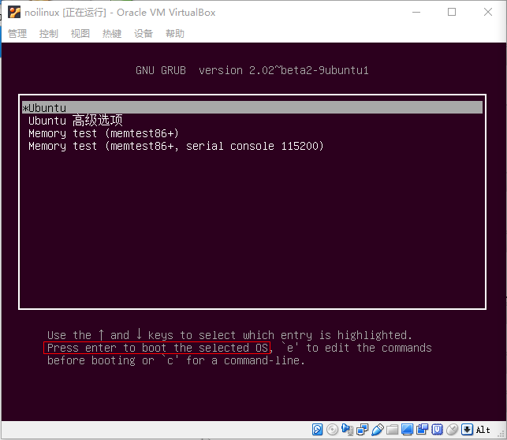
3. 输出密码123456，按回车键进入系统
  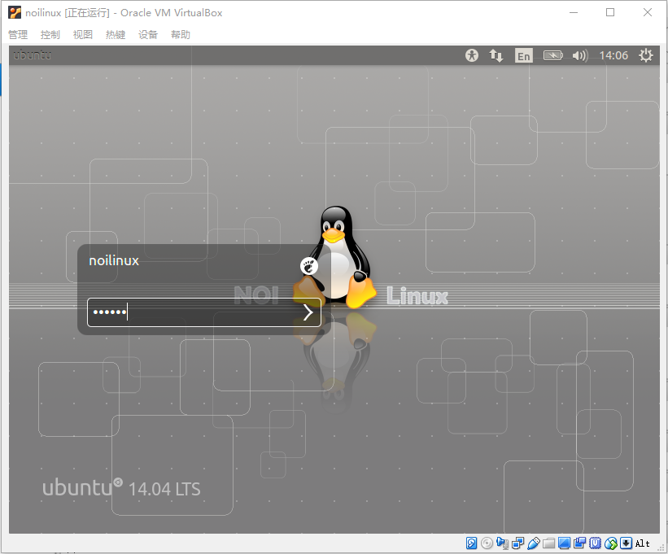

## 安装增强功能

宿主机的各项操作，如鼠标和键盘；虚拟机的各种输出，如屏幕，都需要频繁的互动交流，直接使用虚拟机交互效果可能不够理想，可以通过安装增强功能解决这个问题。

1. 选择“设备”，“安装增强功能”
  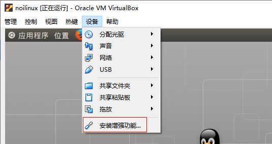
2. 点击“运行”
  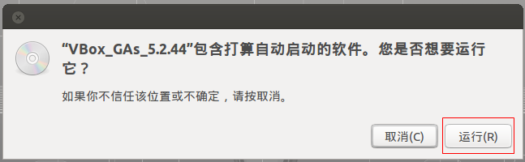
3. 输入密码，并点击“授权”
  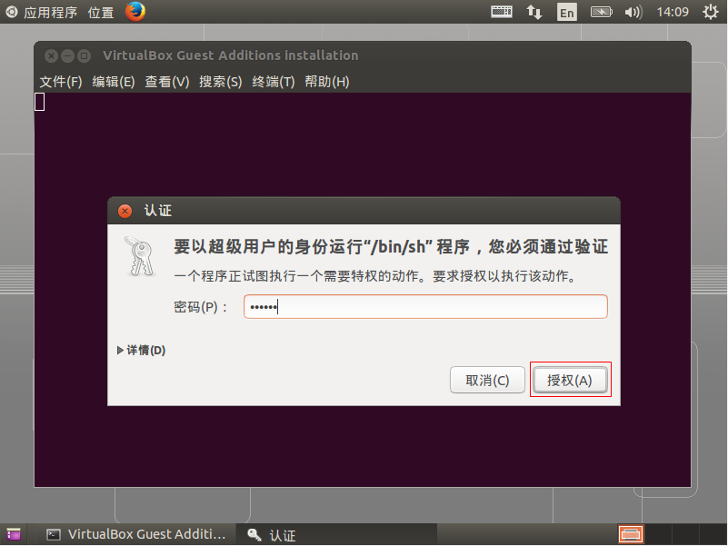
4. 等待安装
  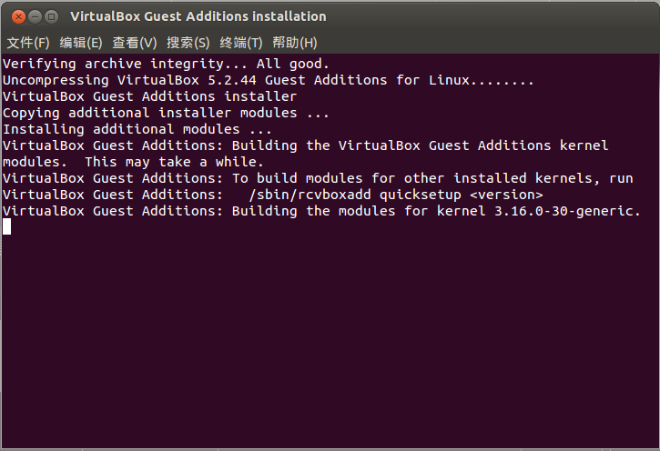
5. 直到出现“按回车键关闭该窗口”时，按回车键
  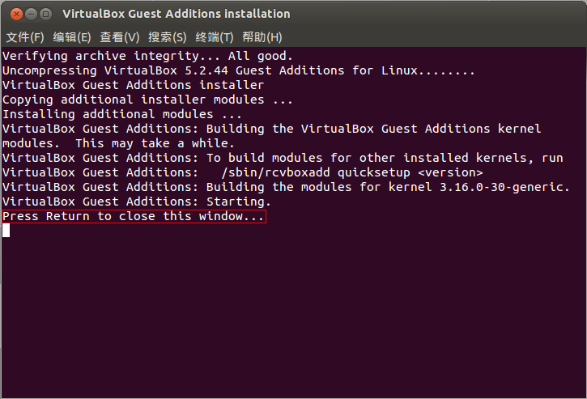

注意：增强功能只需安装一次，没有必要重复安装。

## 重新启动

1. 选择重新启动虚拟机
  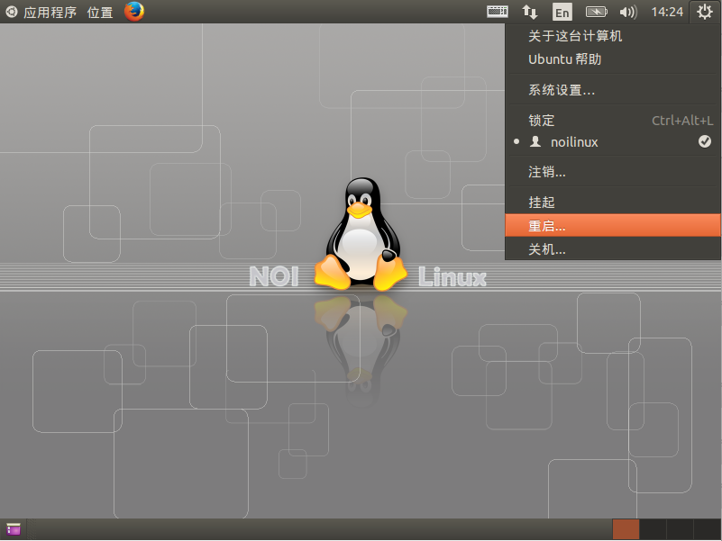
2. 虚拟机的屏幕可以自由缩放，安装完成
  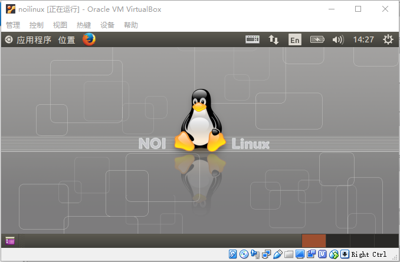

