# 使用GUIDE编写C++代码

辽宁师范大学 &bull; 张大为@[https://daweizh.github.io/noip/](https://daweizh.github.io/noip/)

以NOIP 2017年第23届普及组复赛试题score为例，说明在noilinux下如何用GUIDE进行编程和测试的实践过程。

## 1. 准备复赛环节试题

1. 打开 **Firefox** 浏览器，打开模拟试题的下载网站[https://daweizh.github.io/noip/](https://daweizh.github.io/noip)，选择 **普及组复赛** 或者 **提高组复赛**。   
	    
    **注：** 竞赛实战中你的考题一般会呈现在桌面(~/Desktop)文件夹下。     
2. 以2017年第23届普及组复赛试题为例，鼠标右键 **下载试题** 选择 **Save Link As...** 。    
	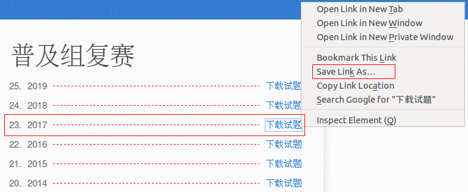
3. 在弹出的保存文件对话框中选择 **Downloads** ，文件名保持默认不变，点击 **保存** 按钮。   
	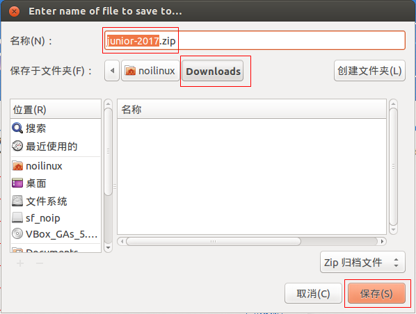
4. 可以点击 **Firefox** 上的 **下载状态按钮** 观察下载进度，等待下载完成。   
	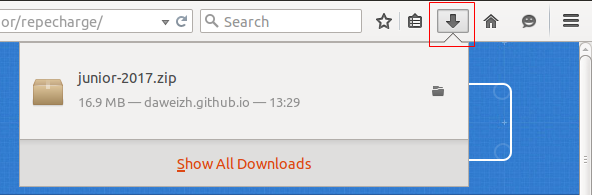
5. 下载完成后，打开 **Downloads** 文件夹，鼠标右键模拟试题 **junior-2017.zip** 压缩包，选择 **提取到此处** 菜单。
	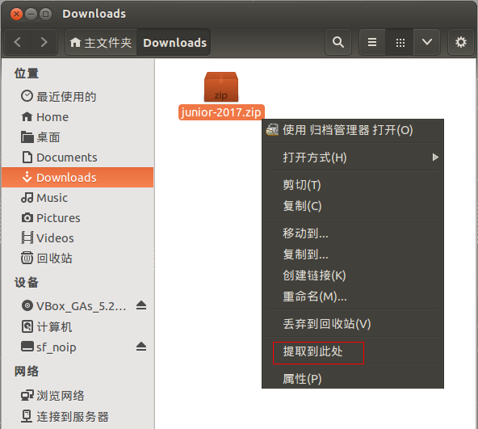
6. 在竞赛实战中此时会提示输入考试密码，注意大小写的区分，数字和英文的区分，不要因紧张着急输错。
	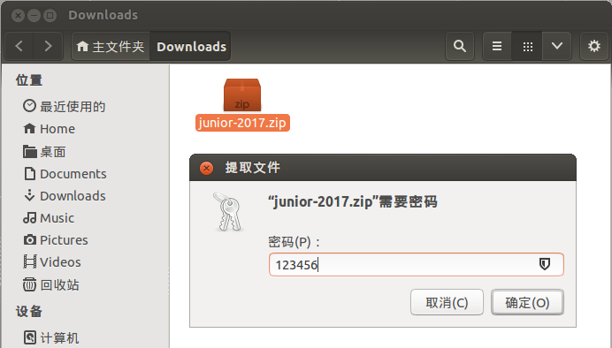
    出现同名的文件夹时，解压完成完成。   
7. 将解压好的试题和测试数据文件夹拖到桌面，用来模拟真实考试试题。
	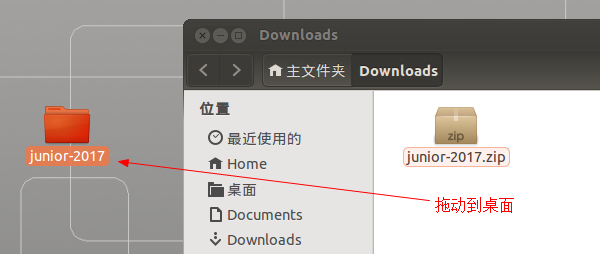

## 2. 准备答题文件夹

1. 在试题文件件上双击鼠标左键进入该文件夹，双击PDF类型的试题文件。打开试题文件后，仔细观察需要创建的试题文件夹名称。
	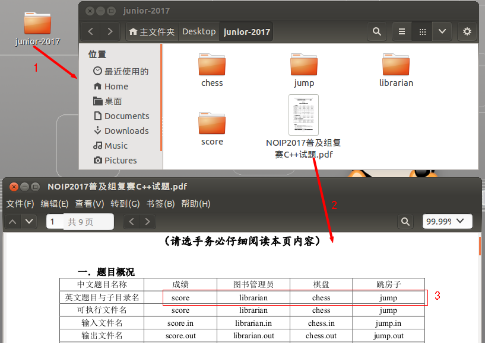
2. 鼠标右击桌面，在弹出菜单中选择“新建文件夹”，创建以考号命名的文件夹。
	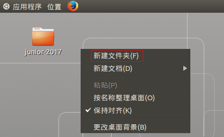
3. 在考号文件夹内创建试题文件夹。
	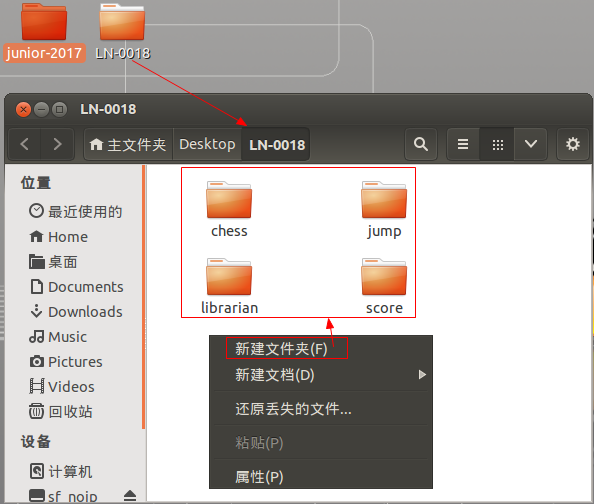

## 3. 用CUIDE写C++程序

1. 选择桌面左上角 **应用程序** 菜单选择 **编程** 子菜单，打开 **GUIDE** 编程环境。   
	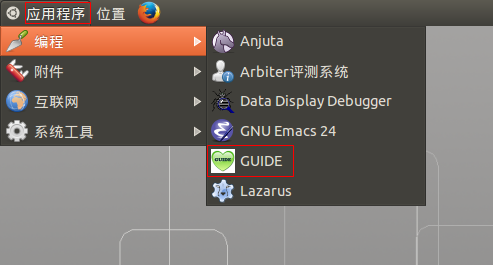
2. 选中考号文件夹，点击“脚印”，选择根目录。
	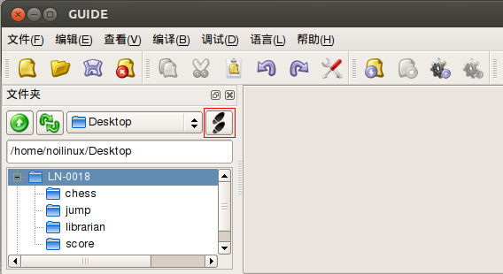
3. 注意“GUIDE”工作文件夹的变化
	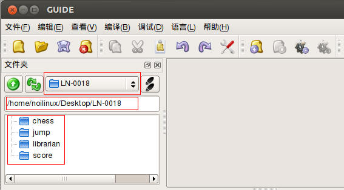
4. 点击“编辑”菜单，点击“选项”子菜单。
	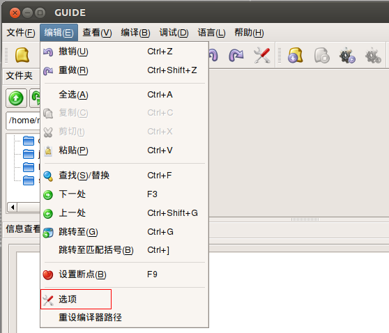
5. 去选自动补全功能。
	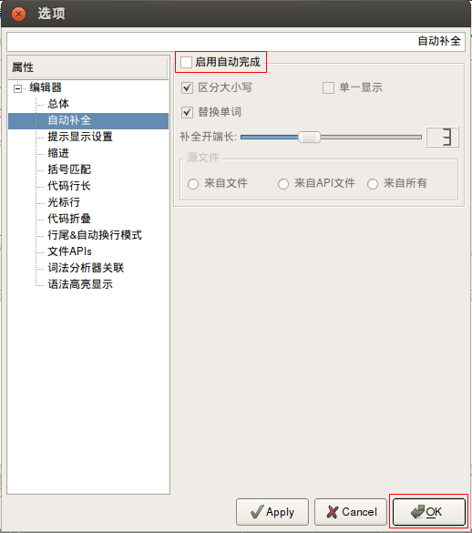
6. 注意工具条上的文件功能按钮
	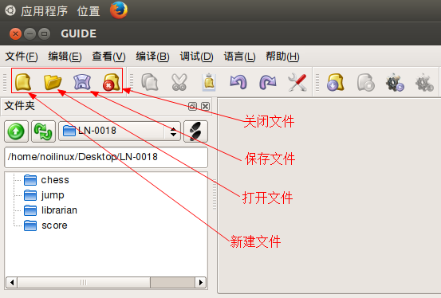
7. 新建文件，并录入如下程序片段
    ```C++
    #include <iostream>
    using namespace std;

    int main(){
        
        return 0;
    }
    ```
	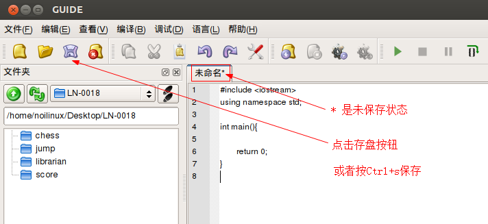
    留心观察文件名状态、字体、字号和颜色等重要信息。
8. 点击“保存”，弹出保存对话框，选择保存路径，并输入文件名
	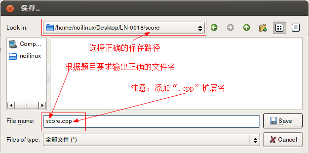
9. 刷新GUID的目录树，观察新生成的文件，注意文件名和文件内容的变化。
	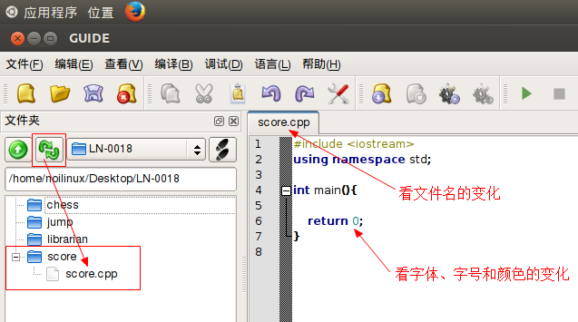
10. 补全程序，并存盘
    ```C++
    #include <iostream>
    using namespace std;

    int main(){
        
        cout << "Hello World!" << endl;
        
        return 0;
    }    
    ```
    点击“编译”菜单，点击“运行”子菜单
	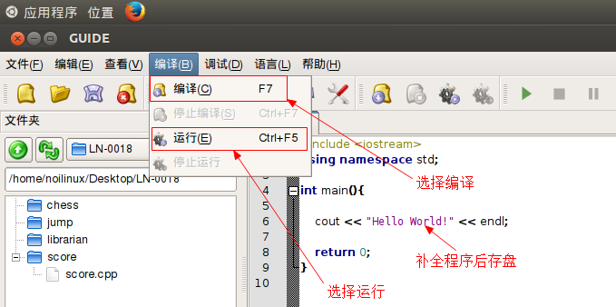
11. 注意观察编译后输出的信息。查看输出结果，并按任意键结束程序运行，关闭终端窗口。
	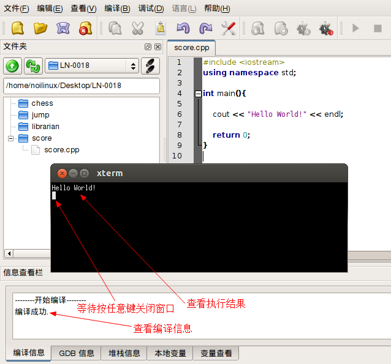
12. 修改score.cpp的内容为题解。
	```C++
    #include <iostream>
    #include <cstdio>
    using namespace std;

    int a,b,c;

    int main(){
        
        cin >> a >> b >> c;
        cout <<  a * 0.2 + b*0.3 + c*0.5 << endl;
        
        return 0;
    }
	```
	按 **Ctrl+s** 组合键或工具条上 **保存** 图标存盘，注意观察编辑窗口标题的变化。
13. 选择 **编译** 菜单，注意 **编译 F7** 和 **运行 Ctrl+F5** 两个子菜单，按 **F7** 键，观察 **信息查看** 栏的输出信息。
14. 按 **Ctrl+F5** 组合键执行程序，输入测试数据并观察执行结果。按任意键关闭窗口。


## 4. 完成可提交的答案代码

1. 在GUIDE中完善刚刚执行通过的程序，增加输入/输出重定向语句。
	```C++
	#include <iostream>
	#include <cstdio>
	using namespace std;
	
	int a,b,c;

	int main(){
		
		freopen("score.in","r",stdin);
		freopen("score.out","w",stdout);
		
		cin >> a >> b >> c;
		cout <<  a * 0.2 + b*0.3 + c*0.4 << endl;
		
		fclose(stdout);
		fclose(stdin);
		
		return 0;
	}
	```
    **注意：**
    - 新增了`cstdio`头文件
    - 新增了`freopen("score.in","r",stdin);`输入重定向语句，注意该语句的位置
    - 新增了`freopen("score.out","w",stdout);`输出重定向语句，注意该语句的位置
    - 新增了`fclose(stdout);`关闭输入重定向语句，注意该语句的位置
    - 新增了`fclose(stdin);`关闭输出重定向语句，注意该语句的位置
2. 按 **F7** 键重新编译（**注意：程序修改了一定要再次保存和编译！！！**）。
3. 如果出现 **编译成功.** 信息，表示程序没有语法错误，如果确定没有逻辑错误，可以作为答案提交。 

## 5. 测试输入输出文件

1. 新建文件，输出测试数据
    ```tex
    100 100 80
    ```
    按要求保存为`score.in`，与`score.cpp`同文件夹
2. 按“Ctrl+F5”执行程序，在`score.cpp`所在文件夹下打开`score.out`文件，并观察执行结果
    ```tex
    90
    ```
    


	
