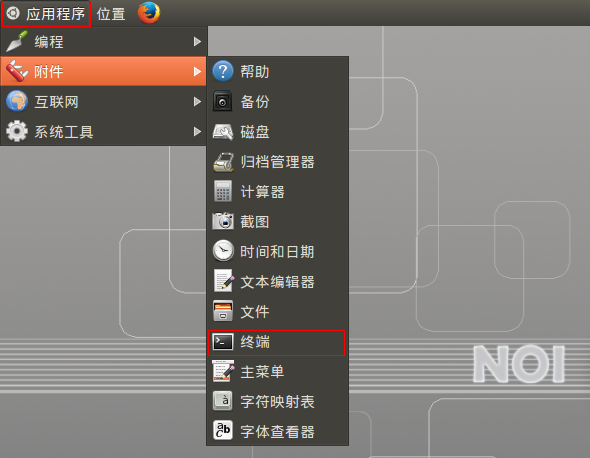
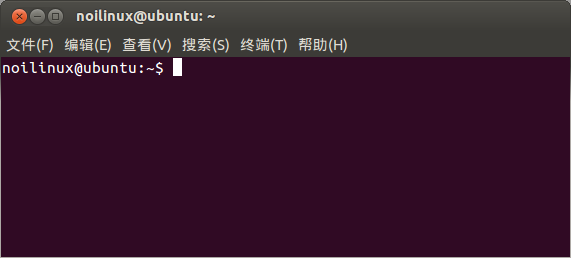
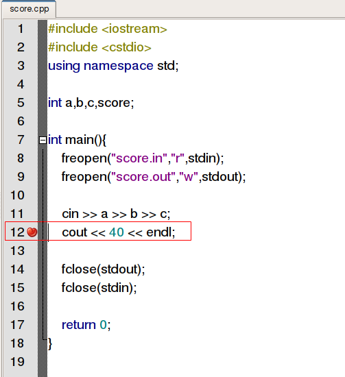

# 调试竞赛程序

辽宁师范大学 &bull; 张大为@[https://daweizh.github.io/noip/](https://daweizh.github.io/noip/)

以 NOIP 2017年第23届普及组复赛试题score为例，讲解竞赛解题的基本过程。

## 1. 准备可提交的最小程序框架

建立最小可提交程序框架。

```C++
#include <iostream>
#include <cstdio>
using namespace std;

int main(){
    freopen("score.in","r",stdin);
    freopen("score.out","w",stdout);

    cout << 40 << endl;

    fclose(stdout);
    fclose(stdin);
    
    return 0;
}
```

1. **Ctrl+s**，将上述代码以文件名 **score.cpp** 保存到与测试数据相同的 **score** 文件夹下
2. **Ctrl+F5**运行，出现如下终端窗口   
       
	**注意：该窗口一定要关闭，否则GUIDE无法响应任何操作**
3. 点击，查看score.out文件内容是否正确
	~~~
	40
	~~~

## 2. 编写对拍程序测试提交代码

针对给定的测试用例，只有通过对拍程序得到Ac才能确定所提交代码可以得分。
编写如下对拍程序，命名为 **score.sh** ，保存到与 **score.cpp** 相同的 **score** 文件夹下。

```bash
#!/bin/bash
i=1
while [ $i -le 10 ]
do
    echo score$i
    cp -f score$i.in score.in
    ./score
    if diff score$i.ans score.out ; then
        echo Ac
    fi
    i=$(($i+1))
done
```

打开终端窗口



终端窗口如下



在终端窗口键入如下命令并执行上述对拍程序

```bash
$ cd ~/noip/2017/score/
$ sh ./score.sh
```

输出的对拍结果如下

```tex 
score1
Ac
score2
1c1
< 50
---
> 40
score3
1c1
< 10
---
> 40
score4
1c1
< 65
---
> 40
score5
1c1
< 70
---
> 40
score6
1c1
< 55
---
> 40
score7
1c1
< 37
---
> 40
score8
1c1
< 46
---
> 40
score9
1c1
< 56
---
> 40
score10
1c1
< 58
---
> 40
```

发现上述结果中只有一个Ac，根据该测试点分值，可得10分。

## 3. 读取输入数据

综合分析试题描述对数据建模，找到基本的输入输出数据存储方式，并确定它们的数据类型。

根据试题描述，用a保存作业成绩，用b保存小测成绩，用c保存期末考试成绩，用score保存总成绩。由于需要计算成绩的只有牛牛，确定数据的读入策略为 **一次性读入** 。

```C++
#include <iostream>
#include <cstdio>
using namespace std;

int a,b,c,score;

int main(){
    freopen("score.in","r",stdin);
    freopen("score.out","w",stdout);

    cin >> a >> b >> c;
    cout << 40 << endl;

    fclose(stdout);
    fclose(stdin);
    
    return 0;
}
```

按 **F7** 编译通过上述程序，将输入光标放在`cout << 40 << endl;`行首，按 **F9** 键设置断点。



按 **F5** 键开始调试，出现如下终端窗口


**注意：一定在调试结束时关闭该窗口，否则GUIDE不响应任何操作** 。在调试状态下，点击 **信息查看栏** 右下的 **变量查看** ，点击按钮依次增加变量 **a** ，**b** 和 **c** ，并观察其 **类型** 和 **值** ，如下图所示。


调试结束后关闭 **调试终端窗口** ，按 **F9** 键去除断点标记。

## 4. 调试并发现程序中的问题

根据试题中给出的计算总成绩的方法，确定数据加工方法（算法）。

```C++
score = a*0.2 + b*0.3 + c*0.5; 
```

其中，**20%=2/10=0.2，30%=3/10=0.3，50%=5/10=0.5** ，完整程序如下：

```C++
#include <iostream>
#include <cstdio>
using namespace std;

int a,b,c,score;

int main(){
    freopen("score.in","r",stdin);
    freopen("score.out","w",stdout);

    cin >> a >> b >> c;
    score = a*0.2 + b*0.3 + c*0.5;
	
    cout << score << endl;

    fclose(stdout);
    fclose(stdin);
    
    return 0;
}
```

按 **F7** 重新编译通过，然后运行对拍程序，观察测试点通过情况。

```tex
score1
Ac
score2
Ac
score3
Ac
score4
Ac
score5
Ac
score6
Ac
score7
1c1
< 37
---
> 36
score8
1c1
< 46
---
> 45
score9
1c1
< 56
---
> 55
score10
1c1
< 58
---
> 57
```

发现后4个测试点并未通过，而且输出结果与答案值相差1。问题出在哪了？再次设置断点，观察`a*0.2`，`b*0.3`，`c*0.5`和`score`的类型和值。


通过上图发现`a*0.2`，`b*0.3`和`c*0.5`的类型为`double`，而`score`的类型是`int`，这样需要在`double`和`int`类型之间进行转换，而且由`double`向`int`类型转换时可能存在着精度损失。

## 5. 改用全整数运算

既然使用整数和小数的混合计算会发生数据类型转换，那能不能进行全`int`型计算呢？下面就是一种方法

```C++
score = (a*20 + b*30 +c*50) /100;
```

完整的程序如下

```C++
#include <iostream>
#include <cstdio>
using namespace std;

int a,b,c,score;

int main(){
    freopen("score.in","r",stdin);
    freopen("score.out","w",stdout);

    cin >> a >> b >> c;
    score = (a*20 + b*30 + c*50)/100;
    cout << score << endl;

    fclose(stdout);
    fclose(stdin);
    
    return 0;
}
```

再次运行对拍程序，观察结果如下：

```tex
score1
Ac
score2
Ac
score3
Ac
score4
Ac
score5
Ac
score6
Ac
score7
Ac
score8
Ac
score9
Ac
score10
Ac
```

所有测试数据全部通过。

## 6. 直接计算并输出

避免数据类型强制转换，可以直接输出计算结果，程序如下

```C++
#include <iostream>
#include <cstdio>
using namespace std;

int a,b,c,score;

int main(){
    freopen("score.in","r",stdin);
    freopen("score.out","w",stdout);

    cin >> a >> b >> c;
    cout << a*.2 + b*.3 + c*.5 << endl;

    fclose(stdout);
    fclose(stdin);
    
    return 0;
}
```

重新执行对拍程序，结果如下

```tex
score1
Ac
score2
Ac
score3
Ac
score4
Ac
score5
Ac
score6
Ac
score7
Ac
score8
Ac
score9
Ac
score10
Ac
```

## 7. 总成绩采用浮点型 

为避免类型转换过程中的精度损失，可用`double`定义总成绩`score`变量，程序如下：

```C++
#include <iostream>
#include <cstdio>
using namespace std;

int a,b,c;
double score;

int main(){
    freopen("score.in","r",stdin);
    freopen("score.out","w",stdout);

    cin >> a >> b >> c;
    score = a*.2 + b*.3 + c*.5;
    cout << score << endl;

    fclose(stdout);
    fclose(stdin);
    
    return 0;
}
```

执行对拍程序，结果如下：

```tex
score1
Ac
score2
Ac
score3
Ac
score4
Ac
score5
Ac
score6
Ac
score7
Ac
score8
Ac
score9
Ac
score10
Ac
```
